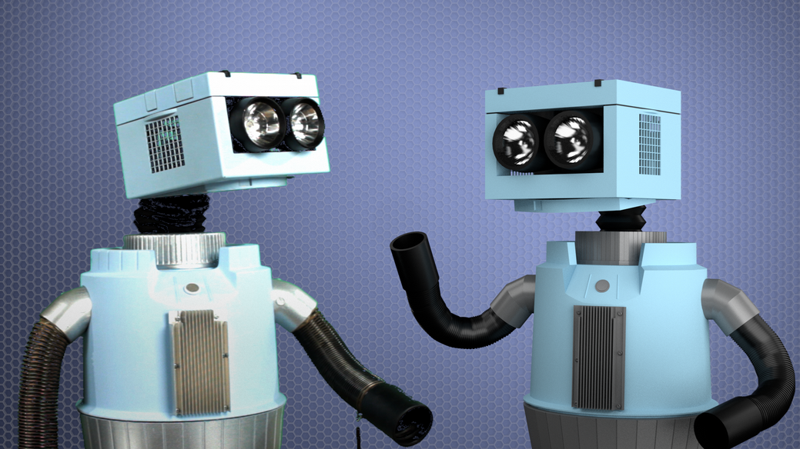
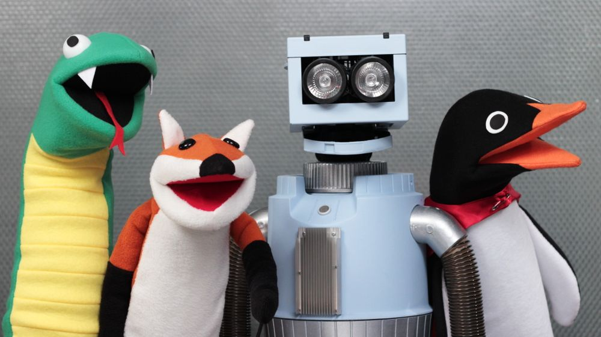

Congratulations! This is the last lesson. We’ve reached the end of our journey. I bet you think you’re pretty smart, don’t you? Well, savor that feeling, because computer scientists are hard at work developing machines and programs to outperform the best of us. What they’re working on is called **artificial intelligence**. They are building computers and robots that can do things humans can do. Or better. Things such as problem solving, learning, understanding language, ‘sensory’ perception, motion, spatial manipulation and creativity.

## What is the Turing Test?

Imagine you make a new friend online and you start a chat. Your new friend is very smart and witty. You are so engaged in the conversation that you lose track

of time. What if, after you signed off, I told you that your new friend was a bot? It was smart enough to ‘trick’ you into believing it was human. That’s the Turing Test. And your friend passed.

## How Do We Use Artificial Intelligence?

Artificial intelligence is already all around us, it just doesn’t look like the sci-fi future we see in movies. Yet. Robots and driverless cars will soon be everywhere. There are a lot of bots on the Internet and in your smartphone. They provide customer service on e-commerce sites and write the news. They give you driving directions and recognize your face in photos. It’s bots that take on the glamorous task of filtering spam. And artificial intelligence is used in a lot of video games to keep you, the player, on your toes.

## Goodbye, World!

And so we arrive at the last paragraph, awed, yet humbled, by our newfound knowledge. We hope you’ll take this knowledge and use it to build a better world.

When you’re finished with that, say ‘Hello!’
