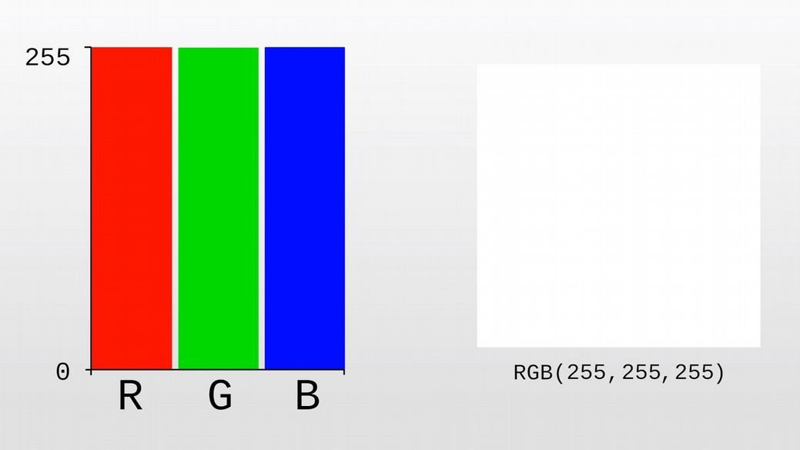

Did you know that the pictures you see on your computer are made up of very small colored dots called pixels? It’s true! Get really, really close to your computer screen and you’ll see what I mean.

That’s too close, back up! Did you see them? Pixels are so small that when you look at them from a distance you don’t notice the individual points.

Each pixel can be changed to a different color by setting the RGB value. RGB stands for Red Green Blue. For instance, this pixel has an R value of 255, which means it is the reddest red that it can possibly be.

A blue and green value of 0 means that this pixel is not at all blue or green. If we increase the blue and green to 255, our pixel will appear white because in the light spectrum, white is a combination of all colors.

If we reduce the red, green, and blue value to 0, the pixel becomes black because in the light spectrum, black is the absence of color.

Think of RGB values as painting with light. We can mix different values to produce a wide range of colors.

A pixel can also have an alpha value that determines how transparent it is. An alpha value of 255 means the pixel is opaque—you can't see through it.

An alpha value of 0 means the pixel is completely transparent—you can't see it at all.

Images are grids of pixels organized in rows and columns called the X and Y axis. The Y axis is up and down, and the X axis is left and right. If that's too hard to remember, then wise up, X is across. As we move down the Y axis, the Y value increases, and as we move right on the X axis, the X value increases.

This green dot here is located at x-8, y-5. If you’re counting along, you may wonder why the coordinates are not x-9 y-6. Much like the cartesian coordinate system, computer graphics have an origin point at 0-0. So this first pixel is actually x-0 y-0, not x-1 y-1. Unlike the cartesian coordinate system, the y-axis is flipped so that we may work with positive numbers. Think of it as a cartesian plane where the bottom right quadrant represents a digital display. We could position pixels outside this quadrant using negative coordinates, but then they wouldn’t be visible to us.

All computer imagery are ultimately displayed as huge pixel grids made of thousands of differently colored pixels, however not all graphics are created this way. Images that are sourced from grids of pixels are called raster graphics or bitmaps. Some common raster graphic types are jpeg, gif, and bmp. Raster graphics are most appropriate for photographs and pixel art.

2D images that are created mathematically from points, lines, curves, and shapes are called vector graphics. Vectors are the paths that make up the shapes in the graphic. The curve and position of these paths can be changed by adjusting control points.

Because vector graphics are just a set of mathematical instructions, their file size is often much smaller than their rasterized counterparts, and they can be scaled to any dimensions without losing quality. If you enlarge a raster graphic too much, you will start to see the individual pixels that make up the image. That doesn’t happen with vector graphics.

Vector graphics are perfect for images that do not require photo-realistic detail

such as maps, line illustrations, and cartoons. The most common format is the Scalable Vector Graphic (SVG) format. The SVG format was created by the W3C— the organization in charge of developing the world wide web standards.

3 dimensional graphics employ similar techniques as vector graphics, but introduce a third axis for depth known as the Z axis. Even though 3D models are created from mathematical expressions representing the position and angle of each vector, they must be rendered in order to view them on a monitor. Rendering is the process of creating a rasterized 2D image from a vector-based model.

