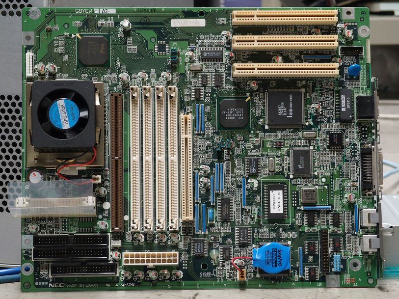
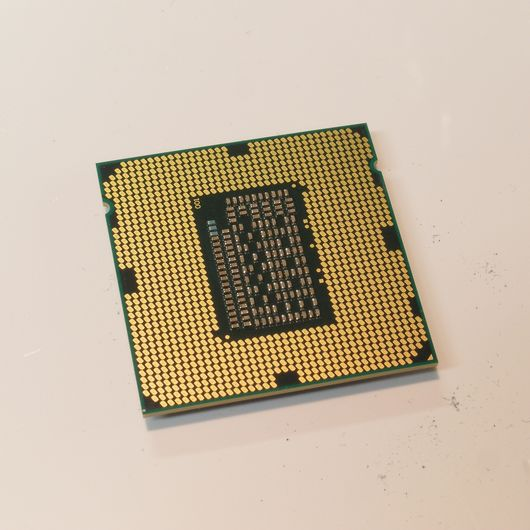
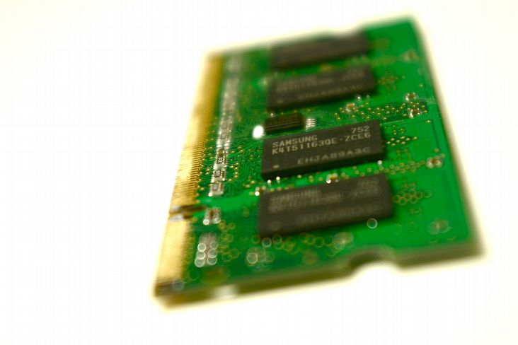
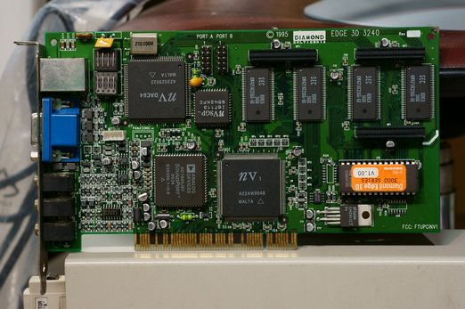
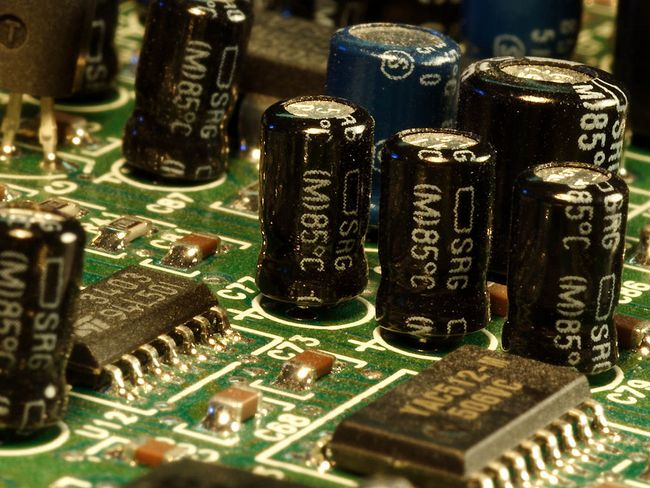
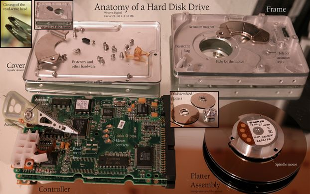
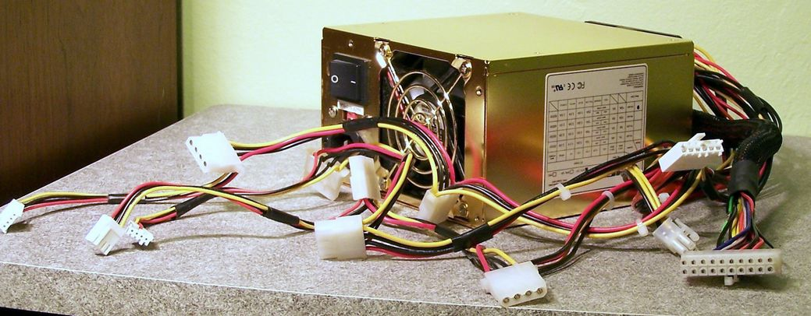

Did you know you can build your own computer? Well, you can. And it’s easier than you think. Computers are made of components that snap together like building blocks. Or Voltron. Even if your computer is a black box, it’s not a _black box_. You can hack it open and swap or upgrade most of the components. And if you can’t, you might want to think about who _really_ owns your computer.

In this chapter, we’ll focus on the major components: the motherboard, the CPU, RAM, the GPU, the sound card, the hard drive(s) and the PSU.

## The Motherboard

Your computer’s components connect to the motherboard. The motherboard is a large circuit board that allows your components to communicate with each other. The places where components connect to the motherboard are called buses.

## The CPU

The CPU, or central processing unit, is the electronic circuitry responsible for executing instructions of a computer program. It commands arithmetic, logical control, and input/output operations. You could say the CPU is the computer because it performs (almost) all of the computations. The CPU has a special seat on the motherboard. Because the CPU can perform millions of calculations every second, it gets very hot, so a fan or a device called a heat sink is often fixed to the top of it to help cool it down.

## RAM

RAM, or random-access memory, is information that is stored temporarily.

RAM refers to temporary memory that can be accessed and altered over and over again. RAM can be accessed by any programs that need to store information temporarily as part of their operations. The more RAM a computer has, the more processing a CPU can do without accessing the hard disk, making the computer much faster. The data stored on RAM is erased once the program finishes its task, or when the power to the computer is cut.

## The GPU

The GPU, or graphics processing unit, does just that: it processes graphics. The GPU displays the information from a video file or game on your screen. Many motherboards feature an integrated GPU, but if you want to do anything processor intensive like play 3D video games, render animation or connect to multiple monitors, you will need a card.

## Sound Card

The DAC, or digital audio converter, generates sound you can appreciate from information in a file. It can also take sound you create, such as your voice or your ukulele, and convert it to a digital format.

## Hard Drive

The hard disk drive, or HDD, records and stores your information. They read and write to and from a spinning disc, much like CDs and vinyl LPs. Because of the moving parts, they are sometimes unreliable. This is why solid state drives, or SSDs, are most often used in laptops for data storage.

## Power Supply Unit

Last, but not least, is the Power Supply Unit. The PSU provides electricity to all of the components inside your computer.
