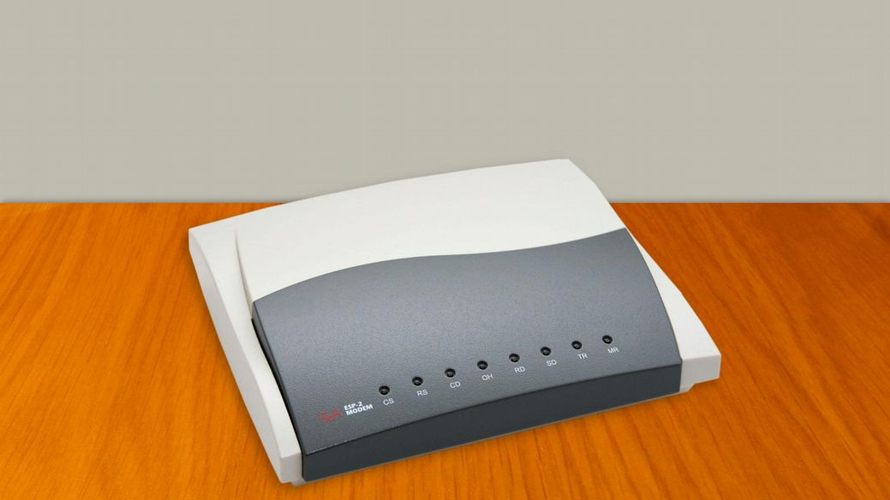

The internet is not something you can just dump something on. It’s not a big truck. It’s a series of tubes! And while this comically simple interpretation of the World Wide Web has been the butt of many a joke, it’s not far from the truth!

Despite popular belief, the internet is not owned and operated by one massive entity. It exists in numerous locations on all kinds of hardware. It’s distributed, like a network. Which is where its name originates; it’s an inter-network. These various nodes of the internet are connected by “tubes” of wire and over-the-air broadcasts.

To tap into this network, we need a modem. A modem connects you to the internet by sending and receiving information to and from an Internet Service Provider, or ISP. Everything on the internet has a unique digital address. Even your computer has it’s own Internet Protocol address, which is necessary for routing data back to your home.

You don’t need to know your own IP address, but you do need to know the address of the website you want to access. A web address is called a Uniform Resource Locator, or URL for short. It’s the thing you type into the location bar of your web browser. A URL reveals the protocol, host name, and file requested. The protocol is simply a set of rules used when transferring data online; the most common being HyperText Transfer Protocol, or HTTP. The protocol is followed by the host name, which identifies the address of the web site we want to visit. These generally begin with “www”, which is short for “World Wide Web”, and get more specific from there. If we enter the URL [https://www.thehelloworldprogram.com/](https://www.thehelloworldprogram.com/) science in our browser, the ISP knows that we are using the HyperText Transfer Protocol to get the “computer-science” file from a website called “thehelloworldprogram.com” which is found on the World Wide Web.

From here, our URL will be checked against a Domain Name Server to identify the address of the web server that this site lives on. If the web server is found, the data we requested is returned back to our computer as a series of packets.

These packets describe the type of data contained and how to interpret them, which is why we needed to specify a protocol. When all of the data is collected, our computer puts all the pieces back together like a puzzle.

