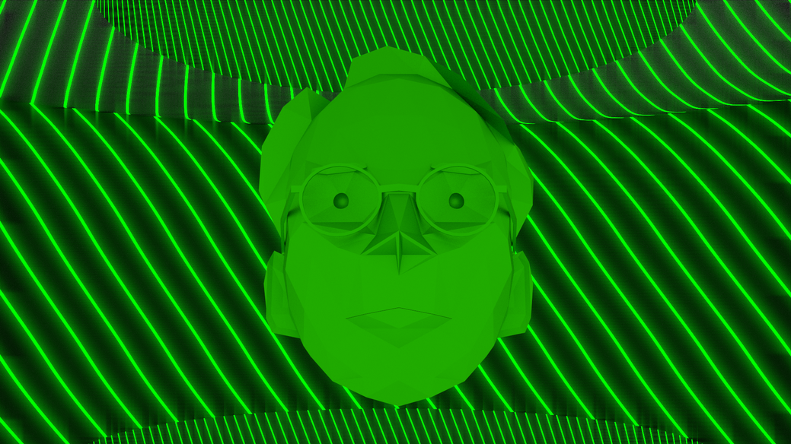
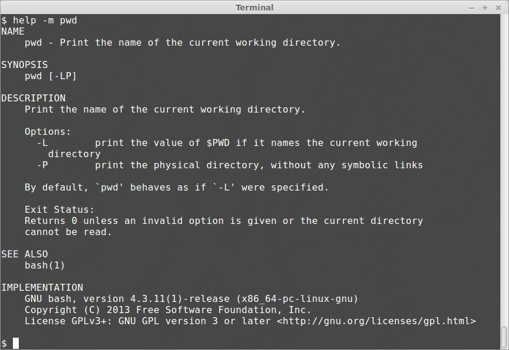
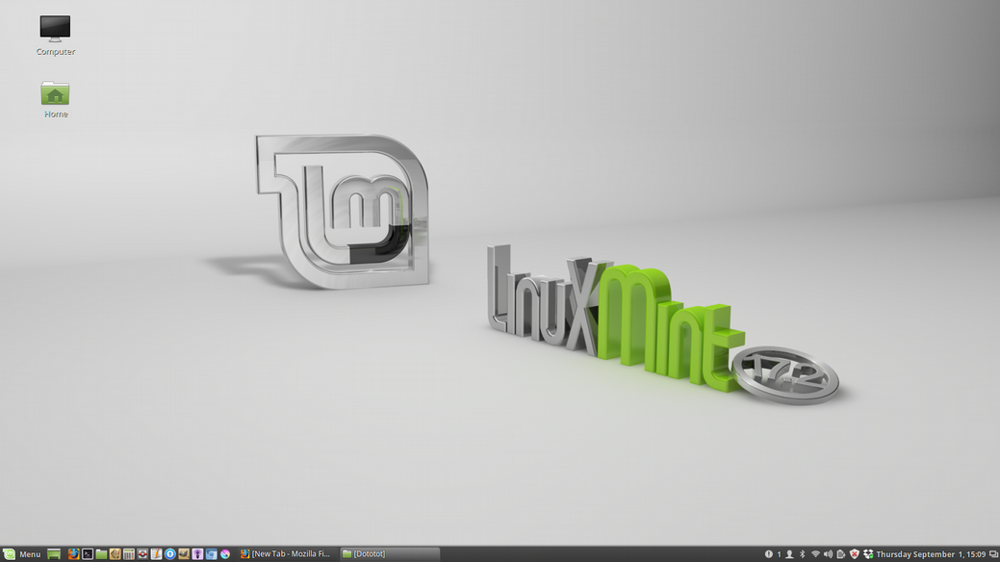

So you built a computer? Before you can play All Your Base or watch ”Daisy’s Web Dev Diary”, you need to install an operating system. No, it’s not a medical procedure. An operating system is the interface that connects your computer hardware to applications like your web browser and text editor. You’ve probably heard of Apple OSX and Microsoft Windows. If you have a smartphone, it might be an iOS iPhone or Android. Those are examples of operating systems. Our favorite is Linux.

## How Does an Operating System Work?

Think of your computer like a candy-coated piece of milk chocolate. At the core is the milk chocolate kernel. You can’t communicate directly with the kernel because it will melt in your hand. So you need a hard candy user interface, or shell. The shell is how you tell your computer what to do. The kernel decides the best way to do it. It controls the CPU for program execution, RAM for memory management, and interacts with hardware devices. There are two types of shell you can use to access the kernel: command line interface (CLI) and graphical user interface (GUI). A CLI looks like this:

It's here that you enter text at the prompt. In this case, our prompt is a dollar sign. You can also run multiple commands in a file together. This is called a shell script.

And a GUI looks like this:

A GUI uses windows and icons to navigate your computer’s file system, which makes it a friendly entry point for beginners. The command line might look boring, but as you become a superuser, you will find there are some tasks more easily accomplished with the CLI.
