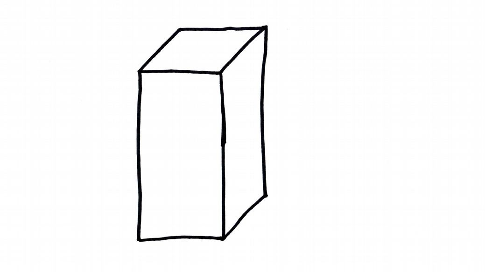
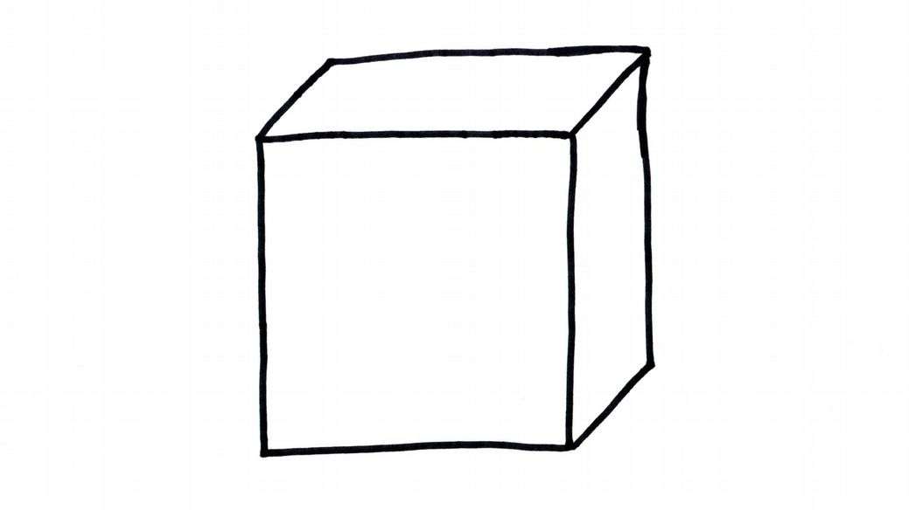
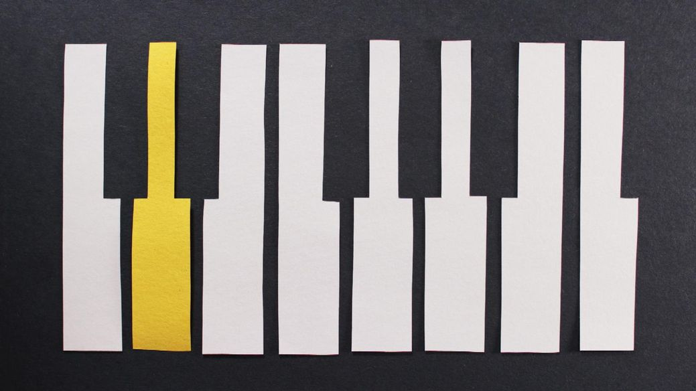
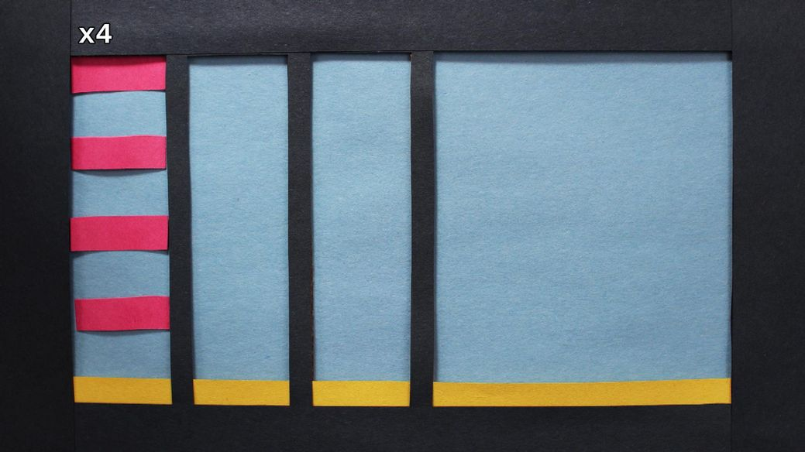
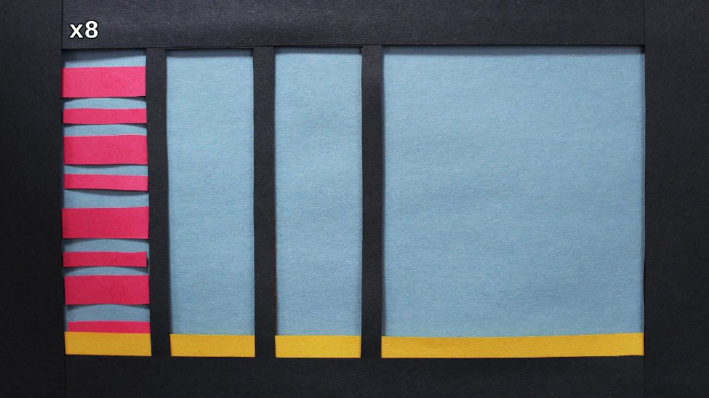
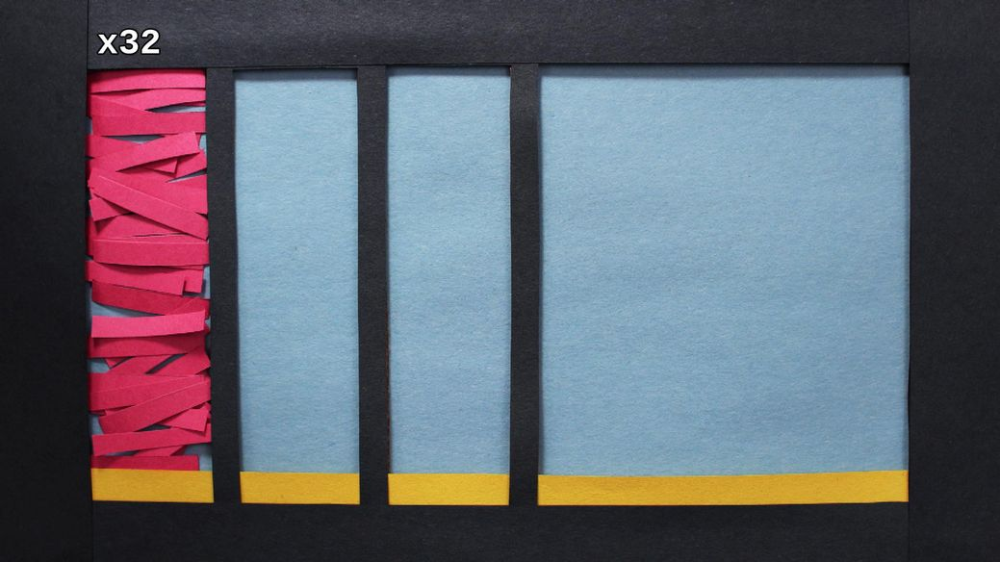
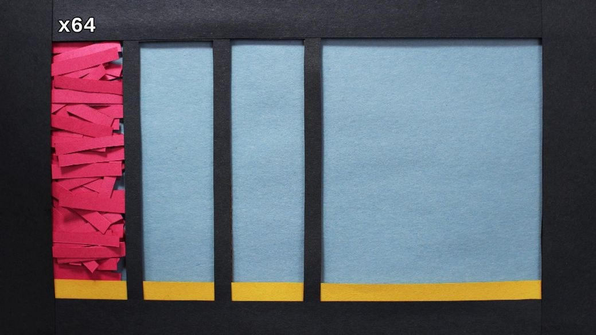
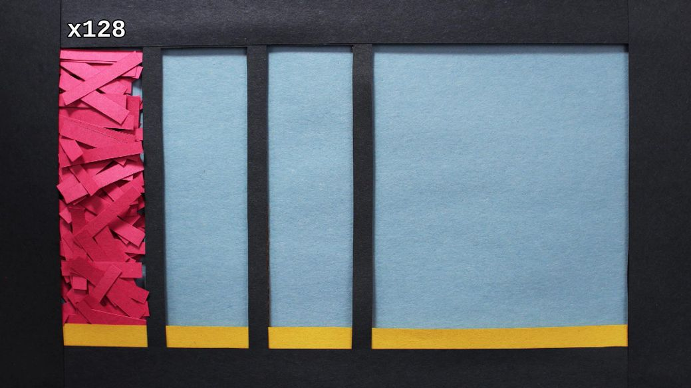

All good things come in twos: de Homem-Christo and Bangalter, Flansburgh and Linnell, Barrat and Fielding, and of course zero and one. As we learned in the previous chapter, zero and one are the possible binary values of a bit. A bit is the most basic unit of computing information.

While foundational for digital communication, we can’t do much with only one bit. However, each time we add one bit of data, we double our potential values. So two bits of data can only represent four unique sequences...

...but three bits doubles our possibilities to eight, or two to the power of three.

The next largest unit of digital information, the byte, is a collection of eight bits. With eight bits of data, we get 256 possible binary arrangements, or the values 0 through 255. Imagine we are composing music with binary. If every note within an eight-note Dorian scale can have two states--off or on--then we can create 256 variations on a song with only one beat.

2^8 = 256

But one beat isn’t very funky, so lets add more using the magic of math!

2^2 = 4

That’s what we call four on the floor! Disco gave birth to electronic dance music and the home computer revolution. In the spirit of Moore’s Law, let’s increase our
power again.

2^3 = 8

See how the beats in our song grow exponentially with each power of 2. Now we have a pretty sweet groove. Just don’t get too carried away!

2^4 = 16

2^5 = 32

2^6 = 64

2^7 = 128

Now you can count like a robot. That’s funky on a mathematical level!
