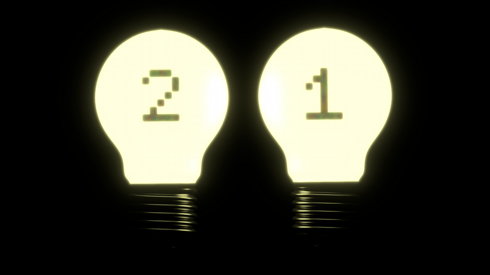
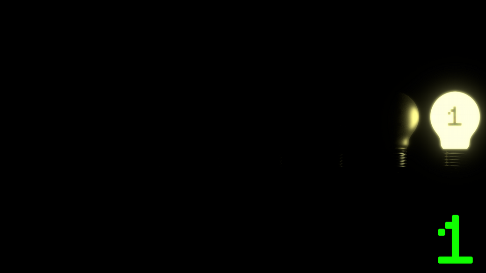
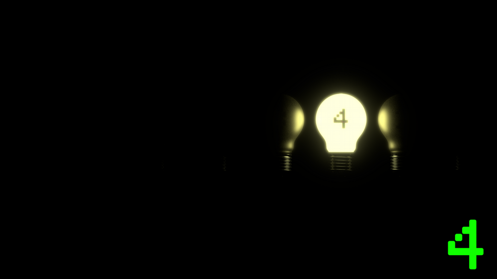

I’m sure you’ve heard this dismissive comment made by Luddites about
computers and all things digital: “It’s just 1’s and 0’s”. Or perhaps you’ve seen
an action movie in which some sort of nerdy hacker-type is pounding away at a
keyboard while an endless stream of 1’s and 0’s scrolls up, as though the operator
understands exactly what he is seeing, and so quickly.

Truth is, pun intended, that computer science is not, at its core, 1’s and 0’s all the
way down. It’s turtles. Just kidding. It’s switches. Your computer, and any
electronic device, in fact, is a series of switches. Some devices are quite simple,
such as a flashlight, others are ridiculously elaborate, like the computer you are
using to read this. You don’t need to know how all of the switches in your
computer work. Yet. Leave that to the engineers for now. What do you need to
know?

### Svool Dliow!

Do you write notes in secret code? That’s ‘Hello World!’ in Reverse Alphabet code,
where A=Z and B=Y and C=X and so on and so forth. But what if you only have
two characters to create your code and they are 1 & 0? That’s binary. Binary is
secret computer code. And ‘Hello World!’ would look like this:

0 1 0 0 1 0 0 0 0 1 1 0 0 1 0 1 0 1 1 0 1 1 0 0 0 1 1 0 1 1 0 0 0 1 1 0 1 1 1 1 0 0 1 0 0 0 0 0 0 1 0 1 0 1 1 1 0 1 1 0 1 1 1 1 0 1 1 1 0 0 1 0 0 1 1 0 1 1 0 0 0 1 1 0 0 1 0 0 0 0 1 0 0 0 0 1

Binary allows us to communicate complex messages with the minimum
characters possible. In the dark? Let’s shed some light on the matter using light
bulbs to illustrate.

Those switches I was talking about above are called bits and they’re the basic unit
of information in computers. This light bulb represents a bit, which has two states:
on and off. We can also think of those two states as True and False. Or 1 and 0. If I
wanted to communicate to you 1 or 0, I would simply turn the light on to signify
‘1’ and off to signify ‘0’. Just like a light bulb, a bit is on if there is an electric

charge and off if there isn’t. But what if I wanted to communicate the number 2?
We would need another light bulb for that.

Each time we add a light bulb to our sequence, we double the potential value. So
with two bulbs, we have four possible states:

off-on, or 01, is equal to 1;

on-off, or 10, is equal to two,

and on-on, or 11, is equal to three.

With both lights off, we have zero. With three bulbs we have eight possible states.

Take a look at this table...

| Value | Binary |
| ----- | ------ |
| 0     | 000    |
| 1     | 001    |
| 2     | 010    |
| 3     | 011    |
| 4     | 100    |
| 5     | 101    |
| 6     | 110    |
| 7     | 111    |

Using our light bulbs, it looks like this...

000

001

010

011

100

101

110

111

### Bits and Bytes

A byte is a group of bits, usually eight. You’ve heard of, or seen, 8-bit graphics.
Eight bits allows us to count up to 255. Including 0, that gives us 256 possible states to store and
communicate information, such as colors and alphanumeric symbols.

Feeling in the dark? See you, no pun intended, in the next chapter, Powers of 2.
