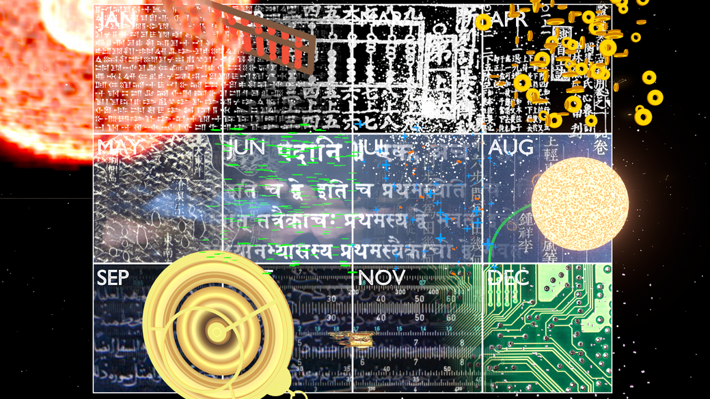
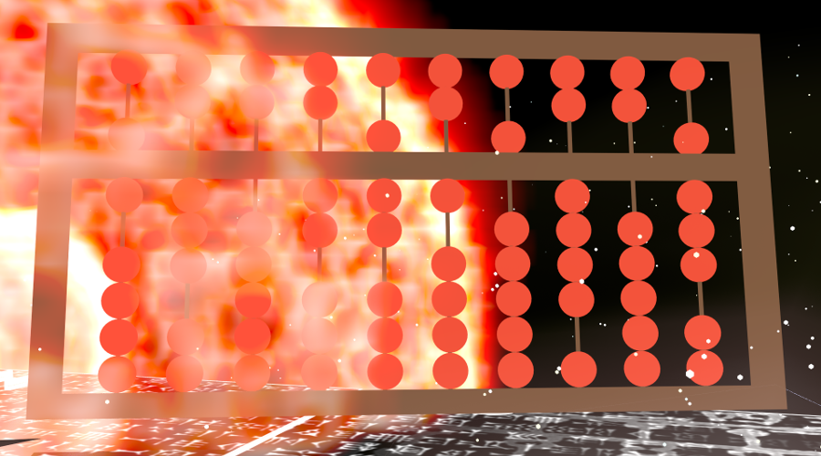
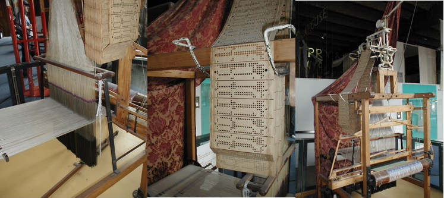
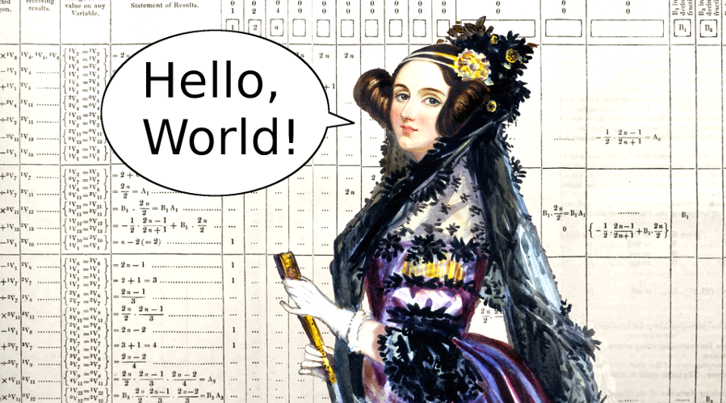
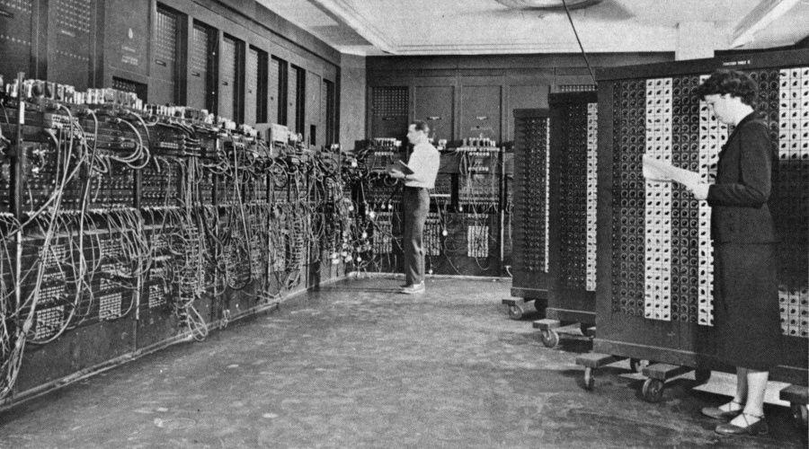
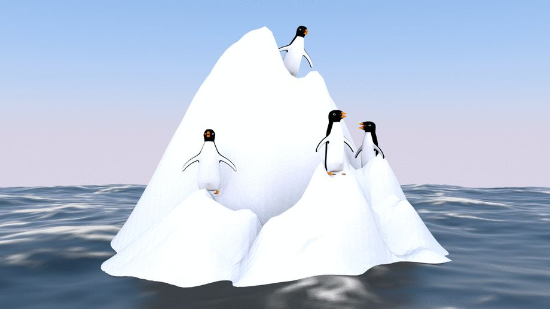
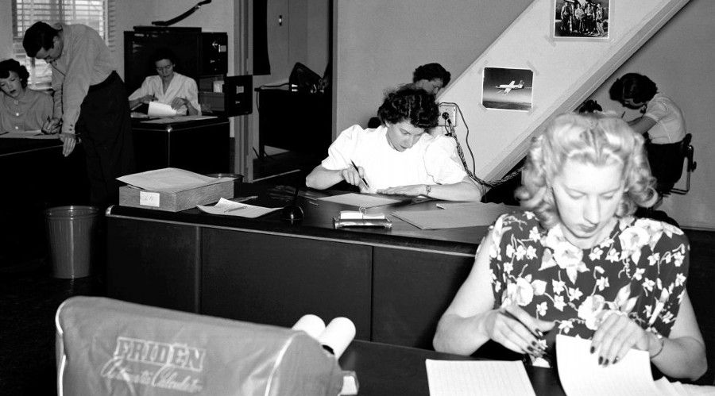
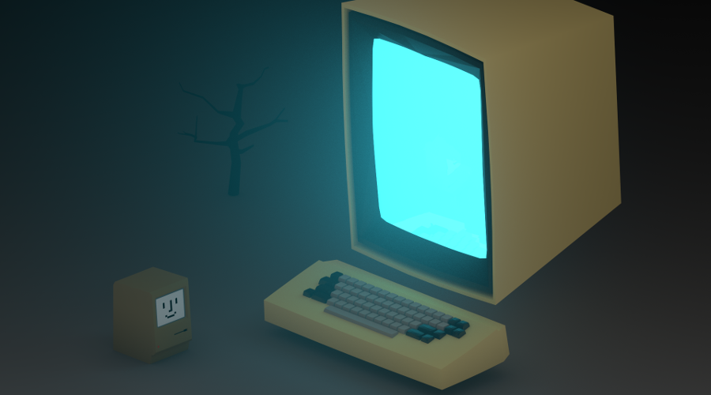

Wikipedia will tell you that **computer science** is “the scientific and practical approach to computation and its applications.” What? That looks like a dog chasing its tail! So the next question we ask: what is the scientific and practical approach to computation and its applications?” Computer science, obviously!

### But what is computer science?

We can’t bootstrap our definition of computer science, so let’s break it down into bite-sized, or should I say, byte-sized, pieces.

#### What is computation?

Any type of calculation or use of computing technology used to process information.

#### What is a calculation?

A process that transforms information.

#### What is information?

The answer to a question of some kind.

#### And what is computing technology?

Any tool that helps you perform computations. You carry one around with you every day. No, not your smartphone. Your brain! But when we talk about computing technology, we are generally referring to human-made objects that help our brains make (and record) calculations. The abacus is the earliest known computing technology. In fact, the first abaci were simply stones placed on lines drawn in the sand. Not much different from today’s silicon chips!

So. how did we go from rocks and sand to robots and smartphones?

### A Brief History of Computer Science

Behold! The Computer Science Calendar! It compresses the local history of computer science, from 2400 BC to present day, into a single year. Each month represents 368 years, each day 12 years. If the first computational tools were made sometime in January, then it wasn’t until December that the modern computer began to take shape.

In the beginning was the abacus. It was, and still is, used for counting and performing simple calculations.

The first known analog computer is the Antikythera Mechanism, used to predict the position of the stars. Because its design is so complicated, it’s believed that there were earlier, simpler analog computers.

In addition to wearing crazy wigs and inventing calculus, 17th century polymath Gottfried Leibniz is considered the first computer scientist for developing a system of binary, the basis of digital technology.

In 1801, Joseph Marie Jacquard unveiled a mechanical loom that used punch cards to ‘program’ the pattern to weave.

In 1837, Charles Babbage developed plans for a computational machine called the “Analytical Engine”, and his assistant Ada Lovelace designed the first algorithm for it. Ada was the first computer programmer, but the Analytical Engine was never built.

It wasn’t until 1946 that the first electronic, general-purpose computer was built; the ENIAC!

The ENIAC was colossal. It was as big as an iceberg and weighed as much as 6,000 penguins. If you own a smartphone, it’s at least 1,000 times more powerful than the ENIAC. That’s a lot of penguins in your pocket!

Before the ENIAC, a human that performed computations was called a computer, and a machine capable of performing the work of a human computer was called a computing machine. Once everyone realized that machines were superior to humans, they simply called them computers.

As computers got smaller and faster, they also became easier to use. It might be hard to believe now, but there was a time when you could only interact with a computer by typing text commands at a prompt. Thank goodness for GUIs, or graphical user interfaces. A graphical user interface lets you do things with icons, like clicking buttons with a mouse pointer. In 1973, Xerox released the Alto, the first computer to use a GUI. Ten years later, Apple and Microsoft brought the GUI to the masses with the Macintosh and Windows.

Now there are computers in everything!

### What Does a Computer Scientist Do?

How many computations could a computer scientist compute if a computer scientist could compute computations?

Say that ten times fast.

But what exactly does a computer scientist compute? Computer science is a big field. We can simplify it by saying there are two branches of computer science: _theoretical_ and _applied_. Theoretical computer scientists work with math and logic writing algorithms, programming languages and data structures. Applied computer science works to solve real-world problems by engineering hardware, writing software, and building robots. There are still plenty of fields in computer science that haven’t been replaced by robots. yet. Programmers and software engineers are needed to develop the applications that command the hardware designed by computer engineers.
