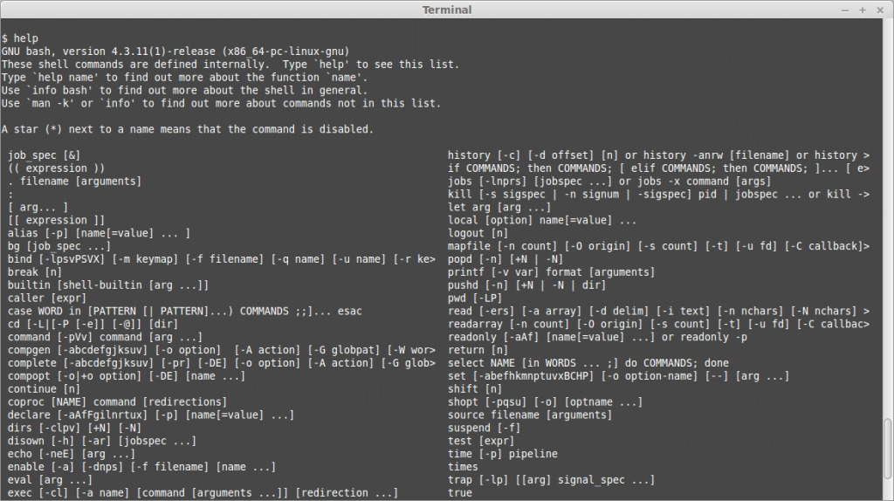
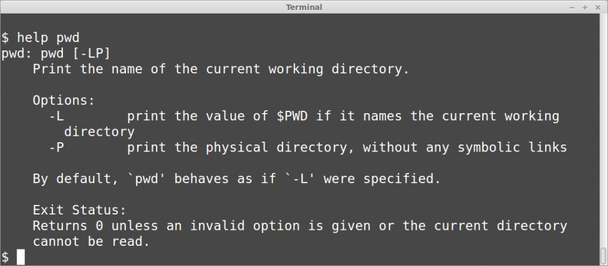
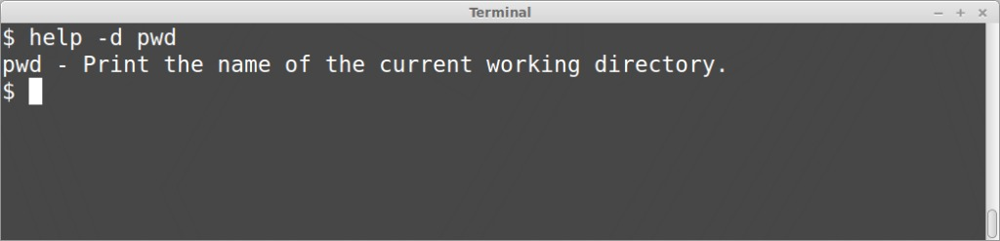
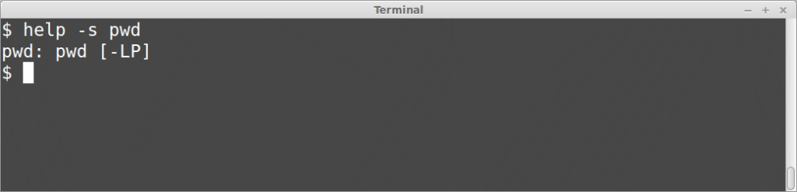
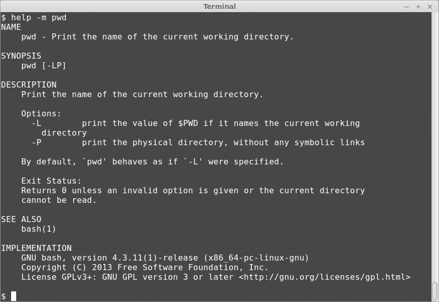

Whenever the shell gets me feeling down, I use the ‘help’ command to get my feet back on the ground. The help command provides information on built-in commands. Built-in commands are any programs bundled with your version of the bash shell. For a complete list of the built-in commands available to you, simply enter ‘help’ at the terminal prompt.

```bash
help
```



That’s all well and good, but what do these commands mean? We could blindly enter them in our shell prompt to see what happens, but lets take a safer approach and use the help command again. At the prompt, enter ‘help’ followed by the command you wish to learn more about.

```bash
help pwd
```



Wow, that’s very helpful! In fact, it’s a little too helpful. I don’t have time to read a whole paragraph, all I want is the TL;DR on pwd. With the ‘-d’ option, the help command will only return a short description of the specified command.

```bash
help -d pwd
```



Aha, now I understand what the pwd command does, but I’m not entirely sure how to use it. Never fear, the help command has us covered. With the -s option, help will return a short usage synopsis for the specified command.

```bash
help -s pwd
```



The -s option shows us all of the options available to us with the pwd command. So we know that there is a -L and a -P option, but what does that even mean? Oh my, perhaps we should have paid more attention to the default output of the help command. But that formatting! It’s definitely not pretty. If you prefer the look of manpages, then you’ll be happy to know that the ‘-m’ option formats the help command output as a pseudo-manpage.

```bash
help -m pwd
```



Pretty slick, right? Next time you’re not feeling so self-assured, just remember to use the ‘help’ command!
