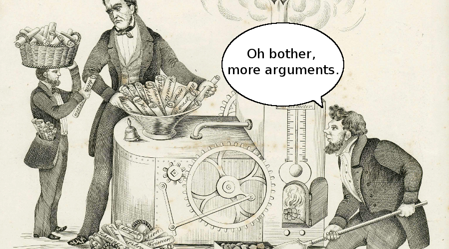
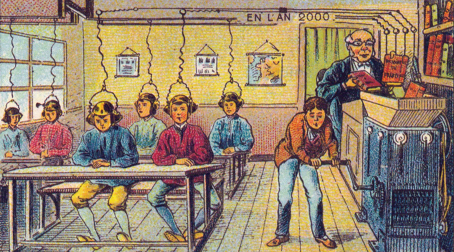

Functions are like little machines in your program. You put something in the machine, press the start button, it works its magic and spits something out. Python functions are incredibly useful. They allow us to reuse code and simplify our programs. The last thing you want to do is waste your time rewriting the same thing over and over. Remember this mantra: Don’t Repeat Yourself. This is called the DRY principle. Not only is it an important tenet of software engineering, it’s also a good rule for life.



## **How Functions Work**

Let’s imagine we have a toaster function. It would look like this:

```python
toaster()
```

You know you’re dealing with a function when you see a string of characters immediately followed by parentheses. Functions are defined by a **name** and accept an **argument**, or multiple arguments. The parentheses are used to ‘catch’ the argument. Why is it called an argument? The history of computing extends back to mathematics and further to astronomy. Latin was then the official language of the sciences and the word _argumentum_ means evidence or proof. So when we pass an argument to a function, we are working with something definite and tangible. Do you want to argue about it?

We pass our toaster argument a piece of bread, like this:

```python
>>> toaster(bread)
toast
```

After performing its operations, the toaster function returns our bread, transformed! Using a function is referred to as a function call. It’s like phoning a friend and asking the time. Your friend is the function. You make the call. Your friend returns the time. Let’s write that in pseudocode:

```python
>>> Jill(“What time is it?”)
The time is now!

```

## **Built-In Python Functions**

You’ve been using functions from the get-go.

This is what you’ve encountered so far:

```python
print()
type()
id()
float()
help()
input()
int()
len()
str()
sum()
```

These are a few of Python’s built-in functions.  Built-in functions are processes used so frequently that they are included with Python. For a complete list, visit: [**https://docs.python.org/3.4/library/functions.html**](https://docs.python.org/3.4/library/functions.html)



Was our tutorial function successful? Let us know in the comments below. The [next tutorial puts the FUN in function](https://thehelloworldprogram.com/python/writing-python-functions-structure/).

```

```
