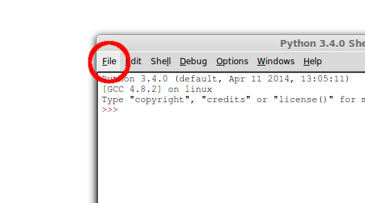
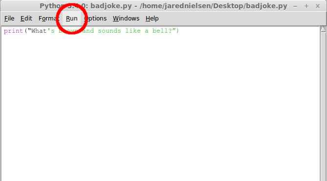
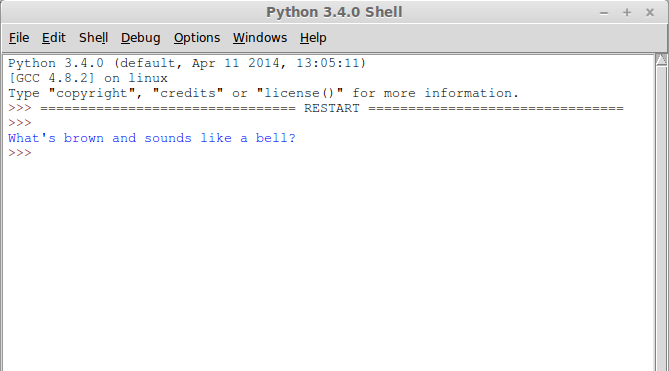
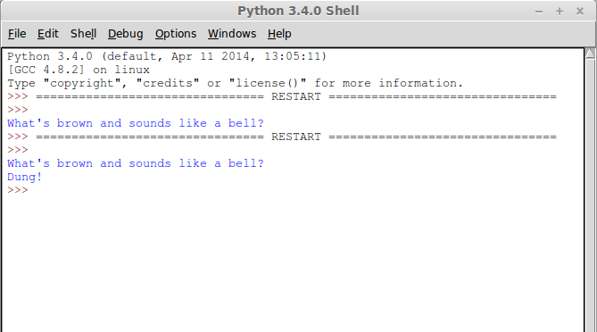

Entering commands at the prompt is just the beginning. Let’s use IDLE to save and run files. With this skill you’ll be able to write and build complex and powerful Python programs. IDLE has two modes: interactive and script. We wrote our first program, “Hello, World!” in interactive mode. Interactive mode immediately returns the results of commands you enter into the shell. In script mode, you will write a script and then run it.

Let’s create a module. We’ll cover modules in depth later. For now, all you need to know is that a module is a file containing Python code ending in the suffix:

```
.py
```

If it’s not already running, start IDLE. Using IDLE is very similar to using a text editor. Under File, select New Window or press **Ctrl + N**. That will bring up a new window titled, “Untitled”.



Enter this command in the Untitled window:

```python
print(“What's brown and sounds like a bell?”)
```

We need to save our file before we can run it. So under File, select Save. At the prompt, name it something clever like:

```
badjoke.py
```

And save it somewhere you can find it later.

Now the fun part. Under Run, select Run Module.



Now go back to the Shell. What’s this RESTART business? The Shell is restarted every time you run a module in IDLE. That’s to clear out any old settings that might interfere with your program. Below the RESTART line you should see:



It’s not much of a joke without a punchline. Let’s modify our module. Change the following:

```python
input(“What's brown and sound like a bell?”)
print(“Dung!”)
```

Let’s run that again, this time with the keyboard shortcut: **F5**. Try that.

In the Shell you’ll see our joke printed, but where’s the punchline? Notice that there isn’t a prompt? That’s because the Shell is waiting for your input. Press any key.



I love that joke. It’s so good and so bad. Know what I mean? Know what I mean? Nudge nudge, say no more.

[Perform mathemagical feats in our next lesson on Python operators](https://thehelloworldprogram.com/python/python-operators/ "Python Operators are Mathematical!").
