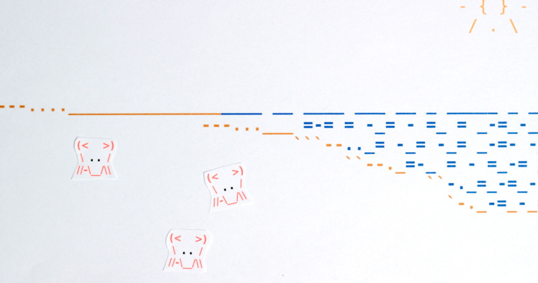

Now that you are familiar with [structural](https://thehelloworldprogram.com/web-development/structural-html-markup/ "Building a Web Page With Structural HTML Markup") and [semantic](https://thehelloworldprogram.com/web-development/semantic-html-markup/ "Adding Extra Information to a Web Page with Semantic HTML Markup") HTML, you know enough to start fleshing out a website. As you add more pages to your website, I bet you are wondering how to connect everything. We can’t very well ask our users to type in a new web address every time they need to visit a new page, so we need to create some sort of site navigation. The anchor element allows us to connect our pages with links. This is easily the most important HTML element, because with a click of the mouse, a link can send you hurtling through the information superhighway. Something this magical has to be complicated, right? Nope. As we will see, there’s almost nothing to it!

We can turn any text or image into a link by simply wrapping it in the `html|<a>` tag and giving it the href attribute. The value of the href attribute is the page we want to go to. This can be an absolute or relative path to a file on our server, or a full web address to a completely different site. For these examples, imagine a simple nested folder structure for our website that goes from root (/) to beach (/beach) to ocean (/beach/ocean).



```html
<!-- Relative path from root to ocean -->
<a href="beach/ocean">Ocean</a>
<!-- Relative path from ocean to beach -->
<a href="../"></a>
<!-- Absolute paths -->
<a href="/beach/ocean"></a>
<a href="http://www.afosfanclub.com">A Flock of Seagulls</a>
```

Notice that we must include the `http://` when linking to a web address. If we tried to use `www.afosfanclub.com`, the link wouldn’t work. The `www` part, on the other hand, is optional. An anchor element with the href attribute of `http://afosfanclub.com` would work just swimmingly. Sometimes when linking to external websites, you will want it to open in a new window or tab. There are several methods for doing this, but the easiest way is with the target attribute. Setting the target attribute to “\_blank” will cause the link to open in a new browser window.

```html
<a target="_blank" href="http://www.afosfanclub.com">
  A Flock of Seagulls (link opens in a new window)
</a>
```

Depending on who you ask, this method is frowned upon because HTML isn’t intended to affect the behavior of the web page. These people will tell you to use JavaScript to provide this functionality, or not do it at all. Between you and me, the target method is perfectly fine and valid in HTML 5. Do be careful with it, though. If every link on your page opens in a new window, your visitors are going to be furious. You may even want to warn a user that the link will open a new window.

Links don’t always have to take you to a new page. If you wanted to direct a visitor’s attention to a specific place on your website, you could use the anchor tag to link to an HTML element. The element you are linking to must have a unique id attribute. In your href attribute, the id of the element you want to link to should be preceded by the pound symbol.

```html
<h1>Welcome to the beach</h1>
<p>
  <a href="#sea-shell">
    Look past the volleyball, squawking gull, and ignore the discardedfolderol.
  </a>
</p>
<figure></figure>
<div class="aves">Squawking Gull</div>
<div><del>folderol</del></div>
<div id="sea-shell">Sea Shell</div>
```

Clicking this link will make the browser “jump” down to the sea-shell div, skipping over the volleyball, squawking gull, and discarded folderol. This technique can be used when linking to other pages, too. Say we are in the ocean directory and we’ve heard enough of the sea. We can make a shortcut directly to the sea shell found in our beach directory’s index.html file.

```html
<a href="/beach/#sea-shell">Sea Shell</a>
```

Every sea shell has a story to tell, if you’re listening. When everything on the top suddenly stops seaming interesting, we can make a link back home.

```html
<a href="/">Go Home</a>
```
