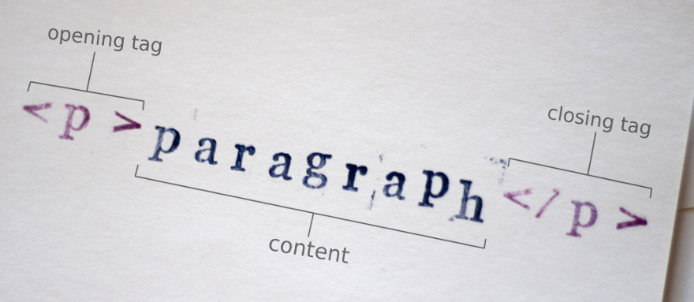
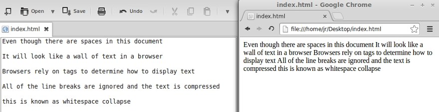

When first delving into web development, the number of programming languages can be overwhelming. It’s true that you will need to learn multiple languages to be able to build dynamic websites, apps, and games, but you don’t need to learn everything all at once. The two essential web languages you will need to learn are HTML and CSS. Nearly every website is built with HTML and CSS. While it’s possible to use a WYSIWYG (what you see is what you get) editor to create a website without writing a single line of code, understanding these languages will make you a better developer and give you finer control over your web applications.

If you’re just starting out in web development, then look no further than Hypertext Markup Language. HTML is the building block of the web. It’s the language that gives your web pages structure and meaning. HTML is not so much a programming language as it is a means of tagging and organizing the content of a page within HTML elements. Elements are like little containers that describe the content inside of them. Generally, elements consist of an opening tag, some content, and a closing tag. This paragraph, for example, is wrapped in the `
` tag.

Web browsers require pages to be formatted in this way because they wouldn’t understand how to display the content sent to them without any HTML elements. If you were to open an HTML document that had no tags in it, your browser would simply display a big wall of unformatted text.

On its own, HTML is not very exciting. While it provides some default style to your content to help distinguish the different elements, it was never meant to be pretty. That’s where Cascading Style Sheets come in. CSS gives you remarkable control over the appearance of your content. You can modify the position, color, and size of every one of your HTML elements, and with CSS3, you can even animate many attributes. CSS3 animations are so powerful, you can even make a functional web game using only HTML and CSS.

CSS can only provide so much interactivity. If you want to build a highly interactive website, mobile app, or game, you will probably want to learn JavaScript. JavaScript allows you to create complicated animations, generate content on-the-fly, and dynamically respond to user input.

It may seem like a lot to take in, but none of these languages are terribly difficult to learn, and with these tools you can bring your awesome ideas to life. All you need to get started is a text editor and a little determination. There are dozens of free text editors, so you’re taken care of there. As for the determination, well that’s up to you. So, are you ready to build your first web page?
