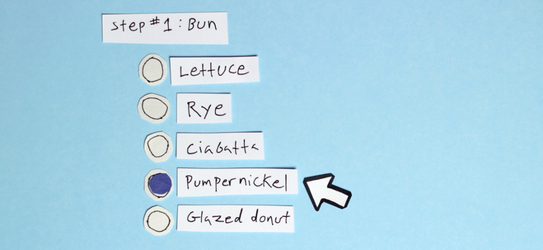
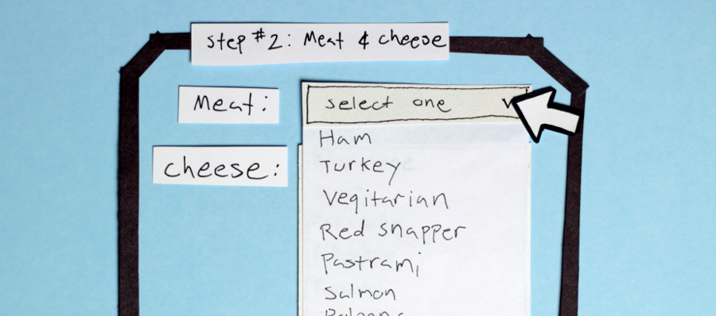
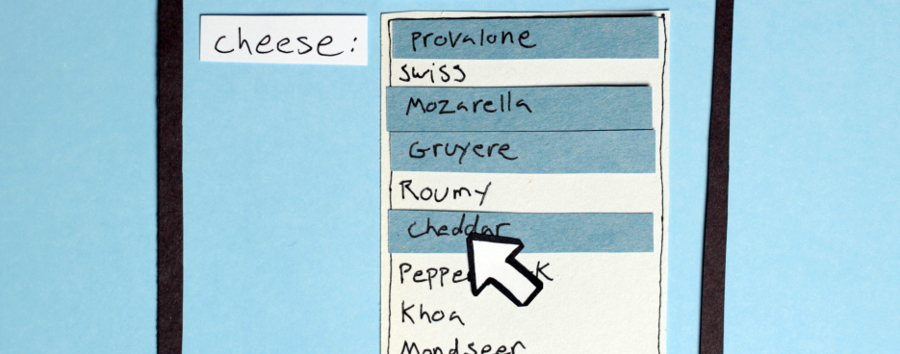
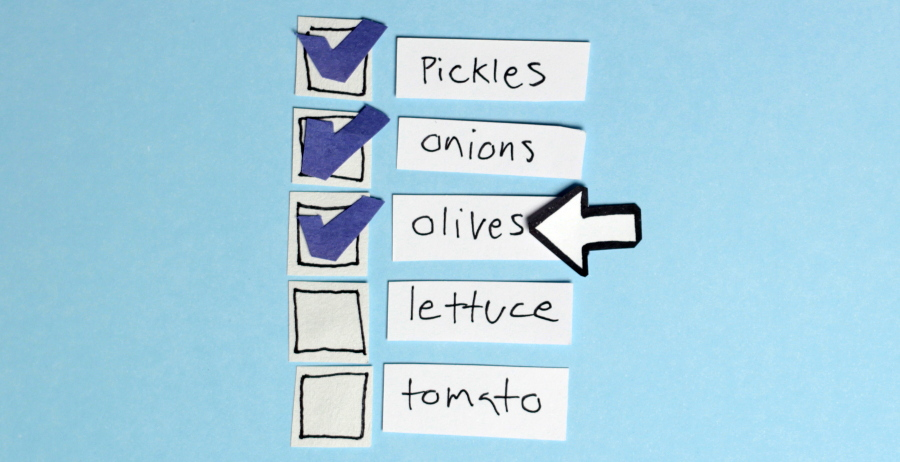
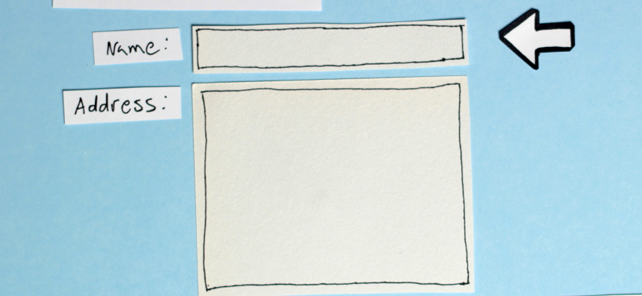

Regardless of what others will tell you, the internet is for forms. There are forms everywhere! Online shopping, personality quizzes, web mail, and even password login systems are all examples of forms. Forms are an excellent way to make a website more interactive and they allow us to collect information from our visitors. To demonstrate the versatility of the HTML form elements, lets create a website for ordering custom sandwiches.

Before we begin, I have to level with you. HTML forms are basically useless without a server-side script to process the data submitted, or JavaScript to provide client-side interactivity. Because learning another web language is a little outside the scope of this tutorial, we’ll just have to pretend that this form works for now.

```html
<form action="order.php" method="post"></form>
```

The action attribute specifies the script on our server that we want to submit the form data to, and the method attribute tells the browser how to do so. It’s not terribly important that you understand these attributes yet, since we aren’t going to write the server-side script, just be aware that they exist.

Lets start our sandwich making with a bun. Because we only want to allow our customers to select one type of bun from a list of options, we’ll use radio buttons. Radio buttons are a type of HTML input. The input element is the most versatile and useful form element. We can transform it into radio buttons, checkboxes, text boxes, and oh so much more, just by changing the type attribute.

```html
<input type="radio" name="bun" value="rye" /> Rye
<input type="radio" name="bun" value="ciabatta" /> Ciabatta
<input type="radio" name="bun" value="lettuce" /> Lettuce
<input type="radio" name="bun" value="pumpernickel" /> Pumpernickel
```



Giving all of these radio inputs the same name lets the browser know that only one may be selected from the group. The value attribute contains the data that would be sent to the server when we submit the form. Only the value of the checked item is sent. We can tell which one is selected in HTML with a boolean attribute called “checked”. If we wanted one of the options to be checked by default, we could add the checked attribute to that input.

```html
<input type="radio" name="bun" value="lettuce" checked /> Lettuce
```

We can organize related fields with the fieldset and legend tags. The meat and cheese choices go well together, so lets group them by nesting them inside of a fieldset element.

```html
<fieldset>
  <legend>Meat & Cheese</legend>
  Meat:
  <select name="meat">
    <option value="ham">Ham</option>
    <option value="turkey">Turkey</option>
    <option value="red snapper">Red Snapper</option>
    <option value="pastrami">Pastrami</option>
  </select>
  Cheese:
  <select name="cheese" multiple>
    <option value="provalone">Provalone</option>
    <option value="swiss">Swiss</option>
    <option value="mozarella">Mozarella</option>
    <option value="gruyere">Gruyere</option>
  </select>
</fieldset>
```

The select element is a little like radio inputs in that it lets our customer select one option from a list of choices. Unlike radio inputs, select options are tucked away inside of a drop down. We’d need to click on the select element to see our choices.



When an option is selected, it gains the boolean attribute “selected”. We could promote red snapper by adding the “selected” attribute to that option, making it the default choice for new customers.

```html
<option value="ham">Ham</option>
	<option value="turkey">Turkey</option>
	<option value="red snapper" selected >Red Snapper</option>
	<option value="pastrami">Pastrami</option>
</select>
```

I love cheese, so I don’t think we should limit the amount of cheeses a customer can select. Adding the “multiple” attribute to our cheese select element will allow our users to select any number of cheeses by holding the control key as they click on the options. With multiple selections, we need to be able to see all of the options, so select elements with the “multiple” attribute will list all of the options in a box, rather than hiding them away in a drop-down.



We should also allow multiple selections for our toppings. We could use another select element for these, but that is admittedly a very clunky element. Checkboxes are a much more elegant solution. They are similar to radio inputs except they aren’t restricted to one selection.

```html
<input type="checkbox" name="toppings" value="onions" /> Onions
<input type="checkbox" name="toppings" value="pickles" /> Pickles
<input type="checkbox" name="toppings" value="olives" /> Olives
<input type="checkbox" name="toppings" value="tomato" /> Tomato
```



Checkboxes not only look nicer than our select element, they are easier to use too. We can make it even more convenient by wrapping the input and the text in a label tag.

```html
<label>
  <input type="checkbox" name="toppings" value="onions" />
  Onions
</label>
```

This way our customers can click on the word “Onion” to select or deselect the checkbox. It would be a good idea to use labels for all of our form elements, because it makes our form easier to use, especially for blind users. If we need more flexibility with positioning our elements, we can also place our input outside of our label element so long as we connect them with the id and for attributes. The for attribute of the label element should match the id attribute of the input it is referencing.

```html
<input id="toppings-onions" type="checkbox" name="toppings" value="onions" />
<label for="toppings-onions">Onions</label>
```

The only remaining information we need to collect from our customer is her name and address. So far, all of our inputs have had pre-set values, but these fields call for a more free-form response, so we’ll use text inputs and textareas.

```html
<label for="name">Name</label>
<input type="text" name="name" id="name" />

<label for="address">Address</label>
<textarea rows="4" cols="10" name="address" id="address"></textarea>
```



Text inputs and textareas allow a user to input a string of text. While their functions are similar, a text input is limited to one line, while a textarea can contain multiple line breaks. The size of a textarea is controlled with the rows and cols attributes. The rows attribute will increase the height of the textarea, and the cols attribute will increase the width. Because text inputs are meant for a single line, only their width can be adjusted.

```html
<input type="text" name="name" id="name" size="10" />
```

The “size” of an input is it’s width in characters. So with this adjustment, the species field would be wide enough to contain nine characters before it started cutting off what our customer was typing. If we wanted to restrict this input to only allow nine characters, we could limit the length of the string with the maxlength attribute.

```html
<input type="text" name="name" size="10" maxlength="10" />
```

If our label isn’t obvious enough, we can put some sample text in a field with the placeholder element. This will disappear as soon as the user starts filling in the input with their own text.

```html
<input
  type="text"
  name="name"
  size="10"
  maxlength="10"
  placeholder="Jane Doe"
/>
```

If, for whatever reason, we wanted to set the default value for a text input, we’d simply need to assign it a value attribute.

```html
<input type="text" name="name" size="10" maxlength="10" value="Jane Doe" />
```

While the placeholder attribute will also work for a textarea, setting a default value with the value attribute will not. The value of a textarea is placed between the textarea tags, rather than in a value attribute.

```html
<textarea rows="4" cols="10" name="address" id="address">111 Fake St.</textarea>
```

All we need now is a button to submit the form. We have three very different options at our disposal: button input, image input, and submit button elements.

```html
<input type="submit" value="Place my order!" />
<input type="image" src="img/order-btn.png" />
<button type="submit">Place my order!</button>
```

Submit Inputs are very similar to button elements. The major difference being where we place the text that will show on the button. Button elements contain the text between the opening and closing tag, while submit inputs contain the text in a value attribute. We could also stick an image inside of a button element, or we could just make an image a button with the image input. The only other attribute an image input needs is a “src” attribute, which I’m sure you guessed, is an absolute or relative path to an image file.

We covered the most common form elements, but that’s only just the beginning. HTML 5 introduces some cool new inputs like date, range, color, and time. See, I told you the input element was versatile.
