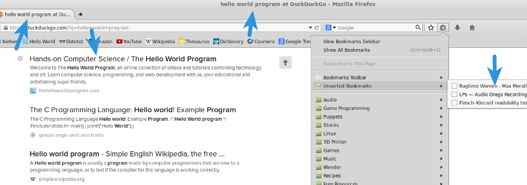

Remember way back when we made our first web page, I mentioned that the body element was where all of our visible elements go. So where do we put the invisible stuff? More importantly, what’s the point of invisible stuff? What does that even mean!? Relax. Take a deep breath. All will be revealed as we learn about the HTML head element. The head element is not unlike your own noggin. It’s contains information about and instructions for a web page. It’s sort of the brains of an HTML document. Also like your own fleshy head, the HTML head belongs right above the body.

```html
<!DOCTYPE html>
<html>
  <head></head>
  <body></body>
</html>
```

Many of the elements that go inside of the head exist to help your web site get discovered by search engines. The title element is especially important for this, and is one of the few required HTML elements. The title is the identity of your web page. It’s how the outside world sees your page in their web browser tabs, their bookmarks, and their search engine results.



Because the title is often the first thing potential visitors will see about your web page, it is critical to write something short, informative, and enticing. There are whole industries built around writing clever titles for Search Engine Optimization, so I’m not really qualified to give you that sort of advice. I will say that it is important to make titles human-readable. For example, “The Hello World Program: Hands-on Computer Science” is better than “Computer Science, Programming, Hands-on”. If you’re looking for something to load up with a string of key words, look no further than meta elements.

While not their only function, meta elements provide another way to assist search engines with discovering and sharing your web site. They are made up of two attributes: name and content. Changing the name of a meta element completely changes its function, so they have a rather wide range of application. You will likely see “keywords” and “description” elements used on most websites, but there are many more types of meta data.

```html
<meta
  name="keywords"
  content="computer science, programming, code, STEM, tutorials, education"
/>
<meta
  name="description"
  content="The Hello World Program is an online collection of programming, computer science, and web development videos and tutorials combining technology and art."
/>
```

Truth be told, keyword data is largely ignored by search engines. This comma separated list of terms was intended to let search engines know what your page was about, but years of abuse have rendered this data practically worthless. Description, on the other hand, is almost as important as our title. It is the snippet of text that will show up in our search engine results. The description should be a short, human-readable overview of our web page content.


If you’ve been following along with these tutorials since the beginning, you should have a pretty good handle on HTML. So, what do you think? It’s not so difficult, right? I know what you’re thinking, so I’ll just say it. HTML by itself is pretty, pretty boring. All of our HTML documents have basically been walls of text with the occasional image or video slapped in. To make our web site truly awesome, we’re going to need to incorporate CSS and JavaScript. CSS is the next step in your web development journey, so lets take a look at that first. We could use the style element to write our CSS directly inside of the head element, like so.

```html
<style type="text/css">
  body {
    background: #000;
    color: #fff;
    font-family: Arial, Helvetica, sans-serif;
  }
</style>
```

This will get very messy and confusing as we start adding more pages to our website, especially if we want to use the same styles on multiple pages. A better way to include CSS in a web page would be to move the contents of the style element to a separate file, such as “styles.css”, and include it with the link element.

```html
<link rel="stylesheet" type="text/css" media="screen" href="css/styles.css" />
```

The link element requires the rel, type, and href attributes. The rel attribute describes the relationship between the current document and the linked document. In this case the linked document is a “stylesheet”. The type attribute further describes the linked document with its mimetype. Of course you recognize the href attribute; this is the relative or absolute path to the CSS file. That media attribute I snuck in there helps a web browser determine what stylesheet to load depending on the type of device requesting it. There are several possible values for the media attribute, the more common ones being all, screen, handheld, and print. Print stylesheets are useful for making sure our website looks nice when it is printed. For example, we could hide things like site navigation and sidebars, increase the font size, or change the font family and color.

```css
body {
  color: #000;
  font-family: "Times New Roman", Times, serif;
  font-size: 150%;
}

#main-nav,
#sidebar,
#footer {
  display: none;
}
```

```html
<link rel="stylesheet" type="text/css" media="print" href="css/print.css" />
```

<p>Don’t worry too much about understanding the CSS; for now it’s only important that you know how to include stylesheets in your HTML documents. Lets take a look at including JavaScript. Like CSS, we could write our JavaScript code directly in the head with the script element, like this:</p>

```html
<script>
  document.getElementById("hello").innerHTML = "Hello World!"
</script>
```

Can you guess what I’m going to say about this method? That’s right. It is much better to move the contents of the script element to a new file and link it. Unlike CSS, JavaScript is linked with the script element, not the link element.

```html
<script src="js/main.js"></script>
```

The only required attribute is “src” which is, of course, a relative or absolute path to your JavaScript file. Now here’s the crazy part, JavaScript doesn’t even have to bee in your head element! In fact, it’s usually better to move scripts to the bottom of your web page, just before the closing body tag. Web browsers load a web page from top to bottom, so moving your external JavaScript to the bottom of the page will make them load very last; after all of the content and styles have already finished loading.

```html
<!DOCTYPE html>
<html>
  <head>
    <title>The Hello World Program</title>
    <meta
      name="keywords"
      content="computer science, programming, code, STEM, tutorials, education"
    />
    <meta
      name="description"
      content="The Hello World Program is an online collection of programming, computer science, and web development videos and tutorials combining technology and art."
    />
    <link rel="stylesheet" type="text/css" media="screen" href="styles.css" />
    <link rel="stylesheet" type="text/css" media="print" href="print.css" />
  </head>
  <body>
    <div id="hello"></div>
    <script src="js/main.js"></script>
  </body>
</html>
```

Now that you know how to include CSS and JavaScript in your HTML document, it’s time to _learn_ CSS and JavaScript. If you are not completely comfortable with HTML yet, you may want to [review the beginning material](https://thehelloworldprogram.com/web-development/how-websites-made/). Otherwise, you are ready to move on to CSS. I promise CSS is way more fun to learn than HTML, and it’s just as easy.
