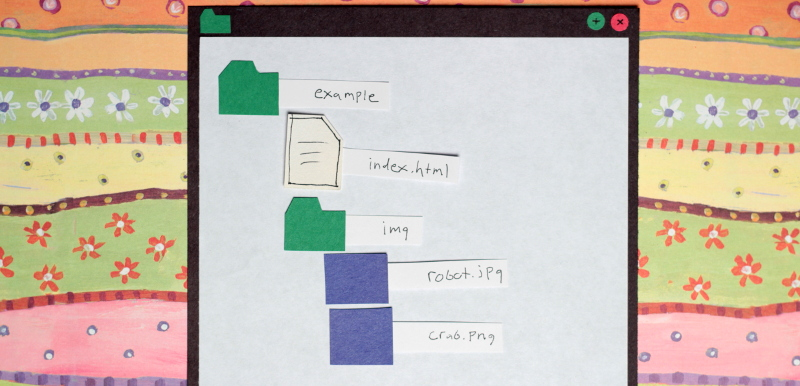
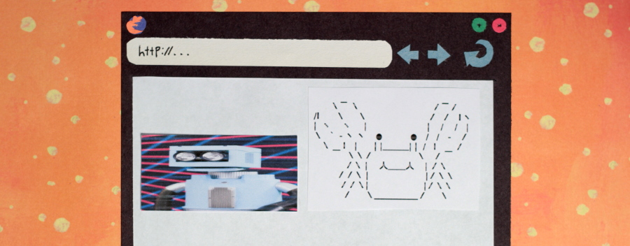

One thousand and one words is worth more than a picture, but not by much. Text certainly has its place in a web page, but sometimes a picture can convey a message much more quickly and effectively than a paragraph. With the HTML img element, including images on our web page is really no sweat. As we start adding more files to our web site, it’s important to stay organized. If you haven’t already, read up on [organizing files and folders for a web site](https://thehelloworldprogram.com/web-development/creating-files-folder-structure-web-pages/ "Organizing Files and Folder Structure for Web Pages").



You may choose to organize your website differently, but for the sake of this tutorial, I’ll assume that you have an index.html file and an img folder with a few images in your root directory. To include an image in our index.html page, all we need is the img element with the “src” attribute. The value of the “src” attribute is the path to the image file relative to the index.html page.

```html

```

Hopefully you didn’t make the same mistake I did.


I forgot to resize my image, so it’s way too big.

## Listen up!

What I’m about to show you is not the proper way to resize images. We should resize images with an image manipulation program, like [GIMP](https://www.gimp.org/), before putting them on our web page. However, it is possible to resize an image with only HTML. You will undoubtedly come across this in the wild, so I’m showing you now for the sake of example. Do as I say, not as I do, and resize your images before putting them on your page. Do you feel significantly warned? Okay…

```html

```

Using a specific pixel value with the width attribute, we can squash or stretch an image. Because we didn’t set a height, the image will be scaled proportionally.


Setting a custom height, we can squish the image disproportionately.

```html

```


As I said before, this isn’t the best way to resize images, because even though we only see a small thumbnail of the image, the entire image is being loaded by our web browser. Our website would take ages to load if we relied on this method for resizing images. That doesn’t mean the width and height attributes are worthless. Specifying the actual width and height of an image helps our web browser know how much space to allot on the page once the image is loaded. This prevents the content on your page from jumping about as images are loaded. With that said, lets try adding another image that is already properly resized.

```html


```

I snuck in a few extra attributes on this one. The value of the alt attribute is often referred to as “alt text”. It should be a description of the image to be used when the picture cannot be seen. This is especially important for blind users who rely on screen readers to read the contents of a web page to them. Without alt text, they would have no idea what the picture was about.

The title attribute provides an opportunity to share extra information with your users. Generally a web browser will display title text as a tooltip when a user hovers over the image with their mouse.



See how these images display next to each other? That’s because images are inline elements. If we wanted them to be separated, we’d need to use a br tag, or wrap them in a block-level element. The figure element is a useful block-level element that can be used with the figcaption element to add captions to pictures.

```html

<figure>
  
  <figcaption>My friend Kamaboko</figcaption>
</figure>
```


You probably noticed that our two images have different file extensions. jpg and png are the most commonly used image formats for the web, but they aren’t the only ones. We’ll get into those later when we cover image formats for the web, but for now just be aware that there are many kinds of images.
