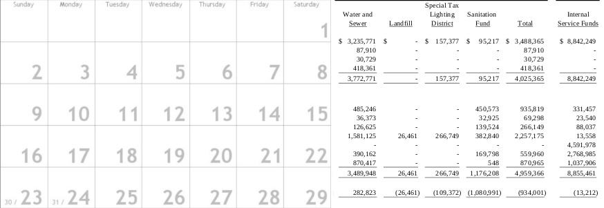
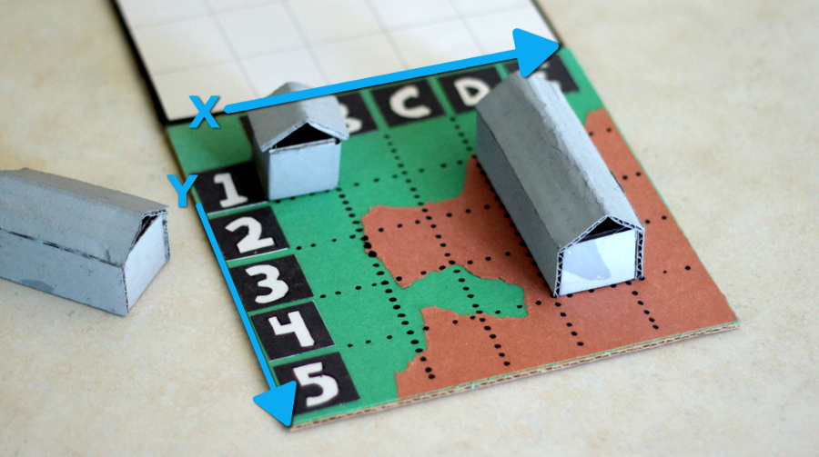
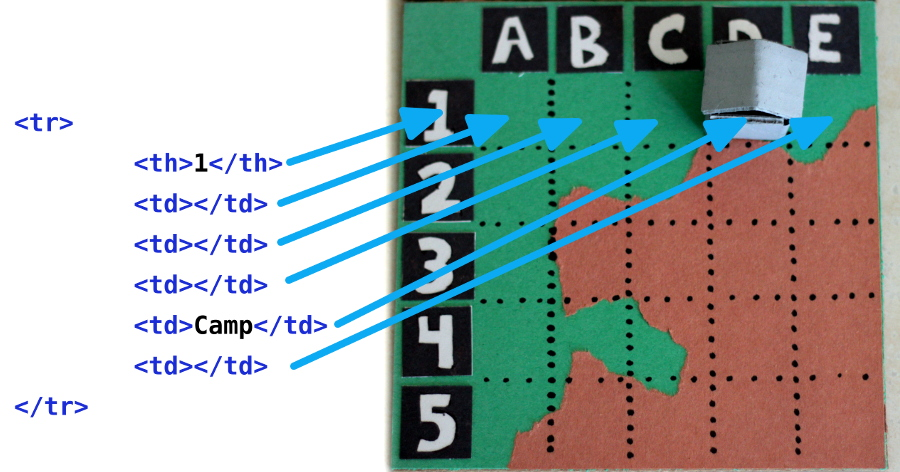
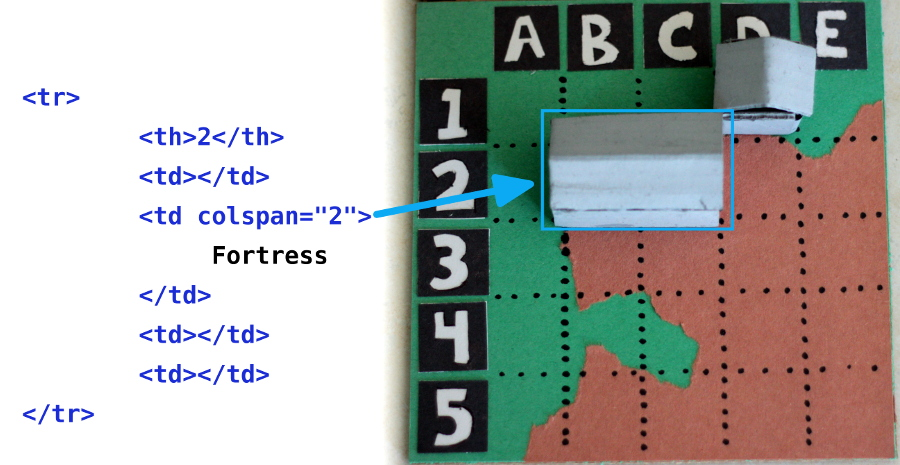
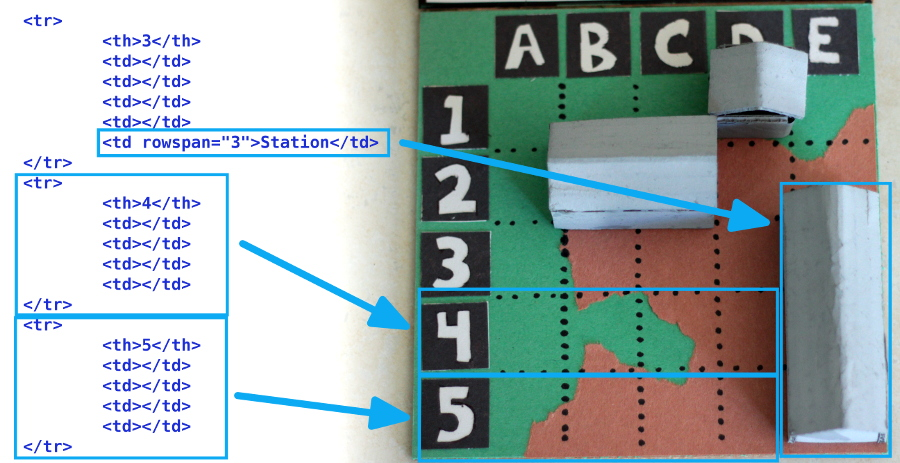

HTML tables have gained some (deservedly) negative notoriety over the years for being used to build web page layouts. Should you ever come across a website built with tables, scream and run around in circles until it crawls back into the hole from whence it came. The truth is, tables have limited application. They are meant for creating boring old grids, and only for creating boring old grids. An example of this might be a calendar or–shudder–an expense report.



Riveting, isn’t it? Don’t fall asleep just yet. Tables may not be sexy, but they are good for organizing data in grids with references on two axes. A grid is made up of rows and columns of cells, which is perfect for building the board for my favorite game that I just made up, All Your Base!



HTML tables are built row by row with the tr tag. Inside of each table row are table data–or td–elements. Each td element acts as a cell in our table. For table headings, we can use a th tag instead of a td tag. Generally, table headings run across the top row of a table to describe the content in the column, but we can also add a th tag to the beginning of each row to describe the content of said row. The complete HTML code for our game board should look like this:

```html
<table>
  <tr>
    <th></th>
    <th>A</th>
    <th>B</th>
    <th>C</th>
    <th>D</th>
    <th>E</th>
  </tr>
  <tr>
    <th>1</th>
    <td></td>
    <td></td>
    <td></td>
    <td></td>
    <td></td>
  </tr>
  <tr>
    <th>2</th>
    <td></td>
    <td></td>
    <td></td>
    <td></td>
    <td></td>
  </tr>
  <tr>
    <th>3</th>
    <td></td>
    <td></td>
    <td></td>
    <td></td>
    <td></td>
  </tr>
  <tr>
    <th>4</th>
    <td></td>
    <td></td>
    <td></td>
    <td></td>
    <td></td>
  </tr>
  <tr>
    <th>5</th>
    <td></td>
    <td></td>
    <td></td>
    <td></td>
    <td></td>
  </tr>
</table>
```

Even though All Your Base is played on a five by five grid, each row of our table has six table cells because the first cell of each row is a heading. That’s also why we had to put an empty cell on the first row of headings.

Using our headings, we can now decide how to place our game pieces on the board. There are three pieces of varying size we need to place on our grid: camp, fortress, and station. The camp only fills one table cell, but the fortress fills two, and the station is a whopping three table cells large. Lets start with the camp, because that one’s easy. I always put my camp in lucky cell D-1\. That means it should go in the fourth cell of the first row.

```html
<tr>
  <th>1</th>
  <td></td>
  <td></td>
  <td></td>
  <td>Camp</td>
  <td></td>
</tr>
```



The other two pieces are tricky because they are bigger than one table cell. We’ll need to span multiple cells in order to get them to fit. I think we should place the fortress horizontally across cells B-2 and C-2\. To do this, we’ll need to use the colspan attribute to merge the second and third cells of the second row.

```html
<tr>
  <th>2</th>
  <td></td>
  <td colspan="2">Fortress</td>
  <td></td>
  <td></td>
</tr>
```

Because the colspan attribute makes one cell act like two cells, we also had to remove one of the td elements from this row.



Here’s where it gets really challenging; placing the station vertically across cells E-3, E-4, and E-5\. Here’s a hint: we can make a table cell span multiple rows with the rowspan attribute. Remember how we had to remove a cell to accommodate the rowspan attribute, then think about how you might apply this when using the colspan attribute.

```html
<tr>
  <th>3</th>
  <td></td>
  <td></td>
  <td></td>
  <td></td>
  <td rowspan="3">Station</td>
</tr>
<tr>
  <th>4</th>
  <td></td>
  <td></td>
  <td></td>
  <td></td>
</tr>
<tr>
  <th>5</th>
  <td></td>
  <td></td>
  <td></td>
  <td></td>
</tr>
```

When we make a cell span three rows, we have to take one cell out of the next two rows to make way for the rowspan. It’s a little confusing at first, so try playing around with different positions for your game pieces until you have a handle on the rowspan and colspan attributes.



Cool! We’re all set up to play! I bet you are wondering what the rules of All Your Base are. Well, it’s basically just a rip off of Battleship…
