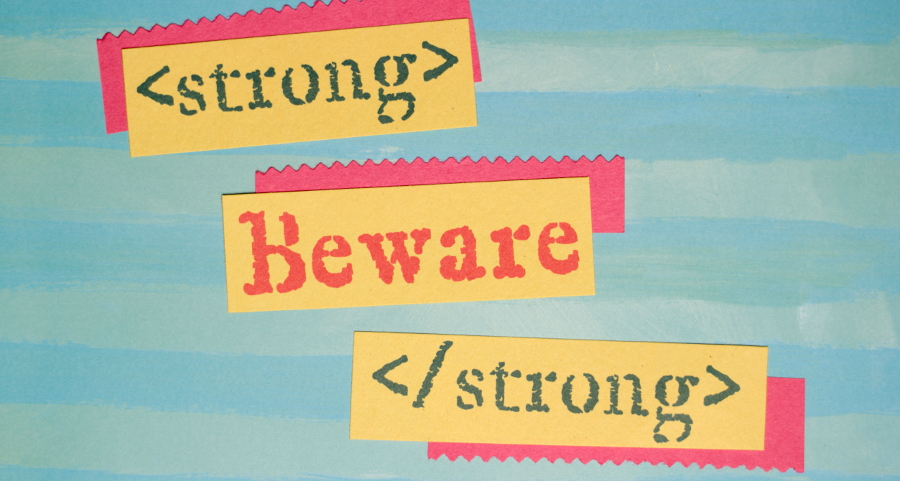
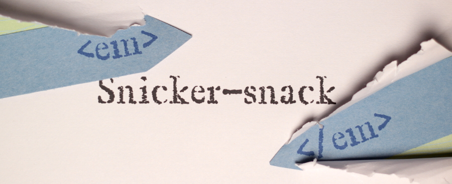
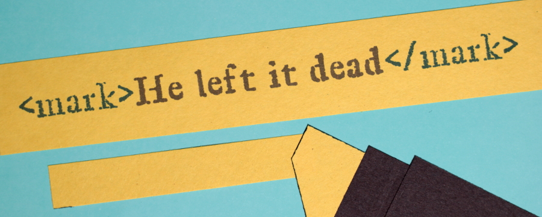
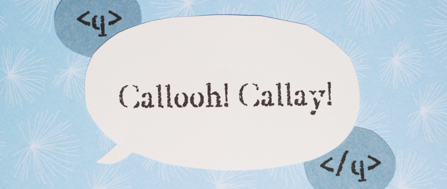

The HTML elements we used to [create the structure of our first web page](https://thehelloworldprogram.com/web-development/structural-html-markup/ "Building a Web Page With Structural HTML Markup") not only gave shape to our page, but also told us a lot about the type of content they contained. Heading elements helped us organize sections of our page, and the blockquote element indicated a quotation from an external source. Using the proper HTML elements to reinforce the meaning of content in a web page is known as semantic markup. There are several elements who’s primary purpose is to add extra information to your text. While many of these elements will alter the appearance of your text, that is not their intended use. Semantic HTML elements are meant to assist screen readers and web crawlers in understanding the content on your page. By now you should recognize this as a common theme in HTML. There are only a handful of semantically neutral HTML elements, and it is very rare that you will use HTML elements for presentational changes. Any visual changes will be made later with CSS. CSS is awesome! HTML is… necessary. So lets take a look at some of the more common semantic HTML elements. I’ll be relating these tags to selections from [Lewis Carroll’s Jabberwocky](https://www.poetryfoundation.org/poem/171647).



Text that has strong importance should be contained in a `html|<strong>` tag. This could be a word of warning or some critical piece of information. In the second stanza of _Jabberwocky_, “beware” is the perfect place for the `html|<strong>` element. Text contained in the `html|<strong>` element will be rendered as bold. Because of this, you will sometimes see the `html|<strong>` element used in lieu of the `html|<b>` element. The `html|<b>` element has no semantic meaning. It’s purely a decorative thing, so it should only be used when no other tag is more appropriate.

This is also the first time the word “Jabberwock” is explained, so we could wrap that in the `html|<dfn>` tag. The `html|<dfn>` element marks the defining instance of new terminology. You would only ever want to use it once per word being explained.

```html
<strong>Beware</strong> the <dfn>Jabberwock</dfn>, my son!<br />
The <b>jaws that bite</b>, the <b>claws that catch</b>!<br />
Beware the Jubjub bird, and shun<br />
The frumious Bandersnatch!
```

Another way we can add emphasis to text is with the `html|<i>` and `html|<em>` elements.



We’ll use the `html|<em>` element to add intensity to the sound effect “snicker-snack” found in the fifth stanza. For the sake of example, we’ll also emphasize the phrase “One, two! One, two!” with the `html|<i>` tag. Both of these tags will display our text in italic. Because they are so similar, it can be a little confusing to know which tag to use. Emphasized text will always go in an `html|<em>` tag. The `html|<i>` tag is for bits of text that convey an alternate voice or mood. Technical terms, thoughts, and phrases from another language are all examples of text that would be better suited for the `html|<i>` tag. As a general rule, use `html|<i>` only when no other tag is semantically appropriate.

```html
<i>One, two! One, two!</i> And through and through<br />
The vorpal blade went <em>snicker-snack</em>!<br />
<mark>
  He left it dead, and with its head<br />
  He went galumphing back.
</mark>
```

Whoa! I think something important happened in that stanza, so I took the opportunity to show you the `html|<mark>`tag.



The `html|<mark>` tag is used to draw attention to a piece of text by highlighting it. I know what you are thinking, and yes you are right, I did say that you shouldn’t use elements for their visual results. We could have combined the semantically neutral `html|<span>` element with CSS to achieve the same effect, but then it wouldn’t mean anything to a computer. We still want screen readers and web crawlers to know that this text is important, so the `html|<mark>` tag is more appropriate than the `html|<span>` tag.

We’ve covered the main semantic HTML tags you will likely encounter in the wild, but we’ve only scratched the surface. The final element I want to show you today is the tag. This is used for short quotations, like the one found in the sixth stanza of _Jabberwocky_.



```html
<q>
  And hast thou slain the Jabberwock?<br />
  Come to my arms, my beamish boy!<br />
  O frabjous day! Callooh! Callay!<br />
</q>
He chortled in his joy.
```

The `html|<q>` element will automatically insert quotation marks around the text contained inside of it. This is one of several ways that it differs from the `html|<blockquote>` element. The major difference being that `html|<blockquote>` elements are specifically for text taken from another source, while the element simply defines a short quotation. Structurally, `html|<blockquote>` is a block-level element, and `html|<q>` is an inline element. We’ll get into the differences between block-level and inline elements later. For now I think we’ve filled our heads with enough ideas for one day.
