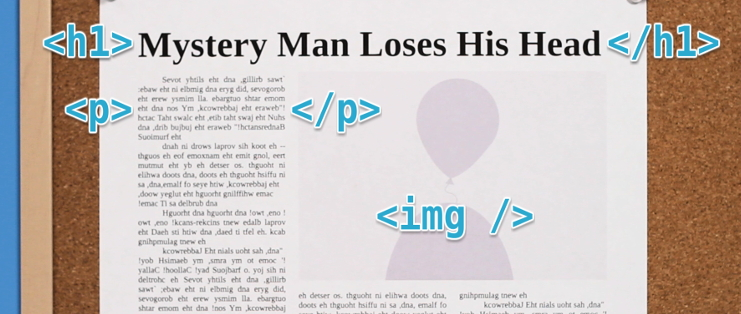

Now that you have a general understanding of the [technology behind web applications](https://thehelloworldprogram.com/web-development/how-websites-made/ "An Introduction to the Technology Behind Web Applications"), lets take a closer look at Hypertext Markup Language (HTML). HTML is used to mark up the content of a web page with elements. Elements are generally made up of an opening tag, some content, and a closing tag. Think of tags as containers that describe the content inside of them. As you look at web pages, newspapers, and magazines, start thinking about how the content is grouped together. This example article is made up of a heading, several paragraphs, and an image. There are HTML tags for each one of these types of content.



An opening tag is denoted with angle brackets, and a closing tag is denoted with angle brackets and a forward slash. Note that the word inside of the brackets won’t actually be displayed on your website, it is simply the name of your HTML tag. Your browser depends on these tags to know how to display the content on your page. Without them, your page would be a wall of unformatted text.


Not all tags have a closing tag. Some tags, such as images and line breaks, only have one tag. While it’s not required in HTML 5, it is good practice to self terminate these tags with a forward slash.

That’s really all there is to HTML, so lets get right to building our first website. Create a new document called “index.html” and open it in your text editor. There are a few special tags that every web page must have. These are only used once and are merely a way to declare what type of document you are creating. The very first tag in an HTML document should always be the doctype. The doctype helps your browser figure out how to format your content by telling it what version of HTML you had in mind when coding your website. This tag is unlike any other HTML tag, so it’s best to memorize this one. Before HTML 5, doctypes were super long and difficult to remember.

```html
<!DOCTYPE html PUBLIC "-//W3C//DTD HTML 4.01//EN" "https://www.w3.org TR/html4/strict.dtd">
```

Fortunately the HTML 5 doctype has been significantly simplified.

```html
<!DOCTYPE html>
```

The other two tags your page must have are html and body tags. All of the rest of your HTML code will go inside of the html tag, and all of the visible parts will go inside of the body tag. So far, our code looks like this:

```html
<!DOCTYPE html>
<html>
  <body></body>
</html>
```

Because our body tag is empty, our website will be nothing more than a blank page, so lets start adding some content. I’m going to make a profile for my robot friend, Unique ID, so he can attract some hot robot babes. We should let the world know the purpose of our web page straight away with some big, bold text. A heading tag does just that. We can choose from one of six heading tags in HTML. These help you structure the importance of your content. Since our tag line is the main heading for our page, we’ll wrap it in an `html|<h1>` tag.

```html
<h1>Unique Robot Seeking Same</h1>
```

Now lets add a short description of Unique ID with the paragraph tag.

```html
<p>I have an electric personality and live life to maximum capacity.</p>
```

Save your file and open it with your web browser.


Looks good so far! But I don’t think ID has much of a chance with the ladies if he doesn’t go into more detail about himself. So lets add a subheading for a new section with the h2 tag.

```html
<h2>Six things I could never live without</h2>
```

By using an `html|<h2>` tag, we are letting our readers and our computer know that the following content still belongs under the umbrella of our `html|<h1>` heading. Remember that the heading tags go all the way down to `html|<h6>`, each one shrinking in size and importance.


Now, if we put the six things that ID could never live without inside of a paragraph tag, they’ll all get jumbled together on a single line. We can make them easier to read by inserting line breaks after each word with the br tag.

```html
<p>
  Electricity<br />
  Servos<br />
  Micro controllers<br />
  firmware<br />
  boot loaders<br />
  Gary Numan
</p>
```

This page is really starting to come together! I think an inspirational quote would do wonders here, so lets add a heading for that.

```html
<h2>Favorite inspirational quote</h2>
```

I used an `html|<h2>` tag again because this is a subheading to “Unique robot seeking same”, not “Six things I could never live without”. If it were a subheading to “Six things I could never live without,” we would need to use an `html|<h3>` tag. We could put the quote in a paragraph tag, but the `html|<blockquote>` tag is even better because it is specifically made for long quotes.

```html
<blockquote>
  Those people who think they know everything are a great annoyance to those of
  us who do.
</blockquote>
```

All HTML tags have some default styles applied to them by your web browser. The `html|<blockquote>` tag, for instance, will indent your text slightly. Keep in mind that even though a tag changes the appearance of your content, you should make sure the tag is appropriate for the content and not base your choices on the visual result. Visual changes will come later with CSS. Lets take a peek at our finished website.


```html
<!DOCTYPE html>
<html>
  <body>
    <h1>Unique robot seeking same</h1>
    <p>I have an electric personality and live life to maximum capacity.</p>
    <h2>Six things I could never live without</h2>
    <p>
      Electricity<br />
      Servos<br />
      Micro controllers<br />
      firmware<br />
      boot loaders<br />
      Gary Numan
    </p>
    <h2>Favorite inspirational quote</h2>
    <blockquote>
      Those people who think they know everything are a great annoyance to those
      of us who do.
    </blockquote>
  </body>
</html>
```

Would you look at that! You just made your very first website and mastered some of the key, structural HTML tags. Next up, we’ll learn how to add meaning to our content and change the format of our text with semantic HTML markup.
